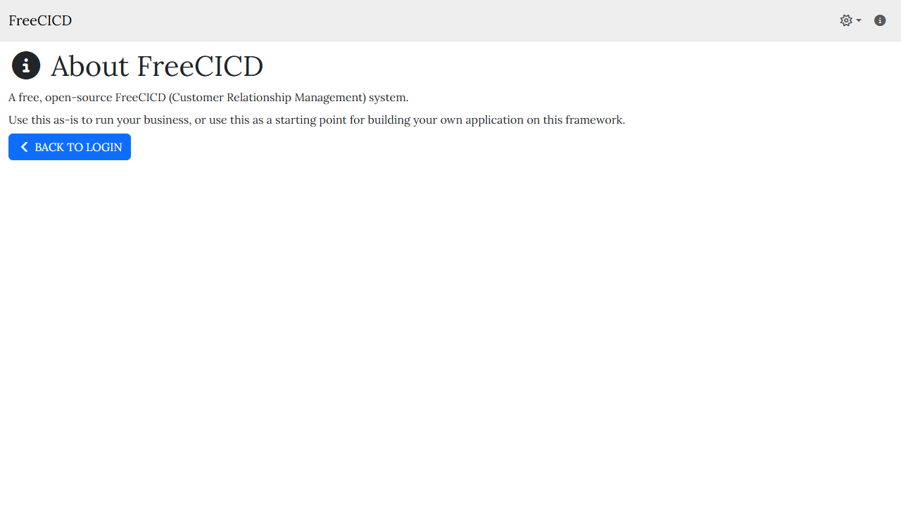
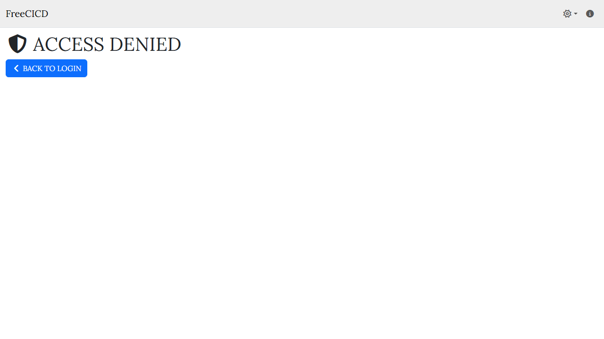
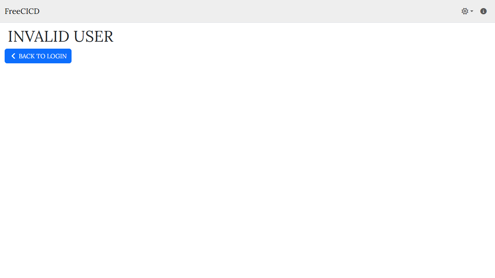
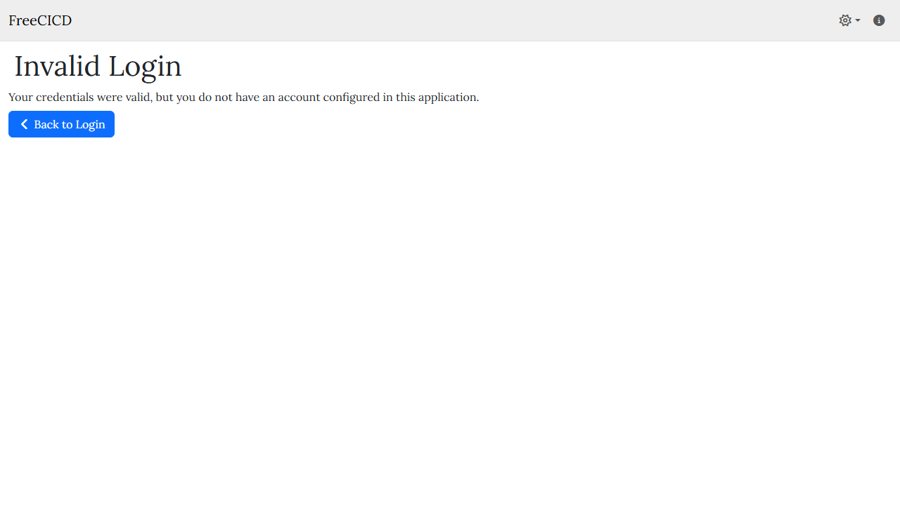
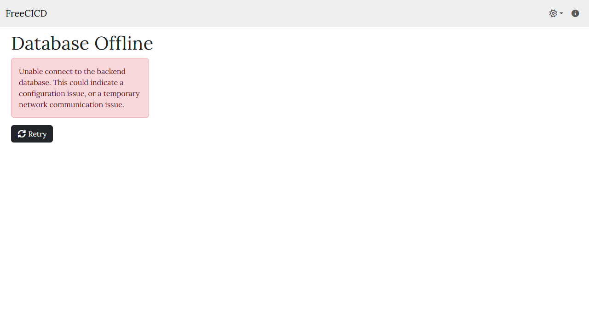
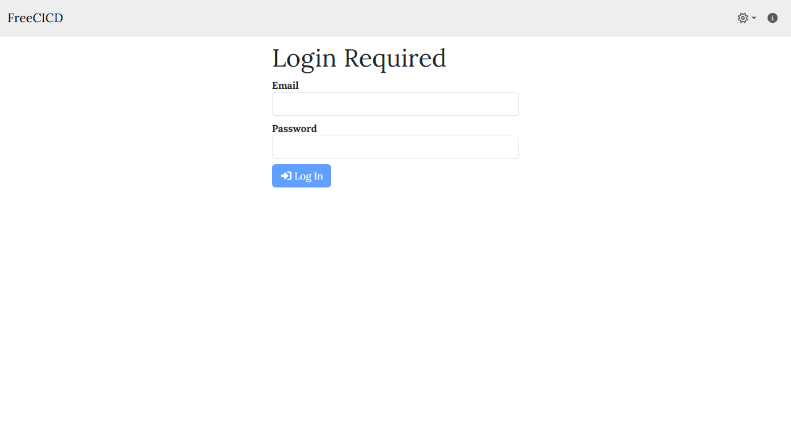
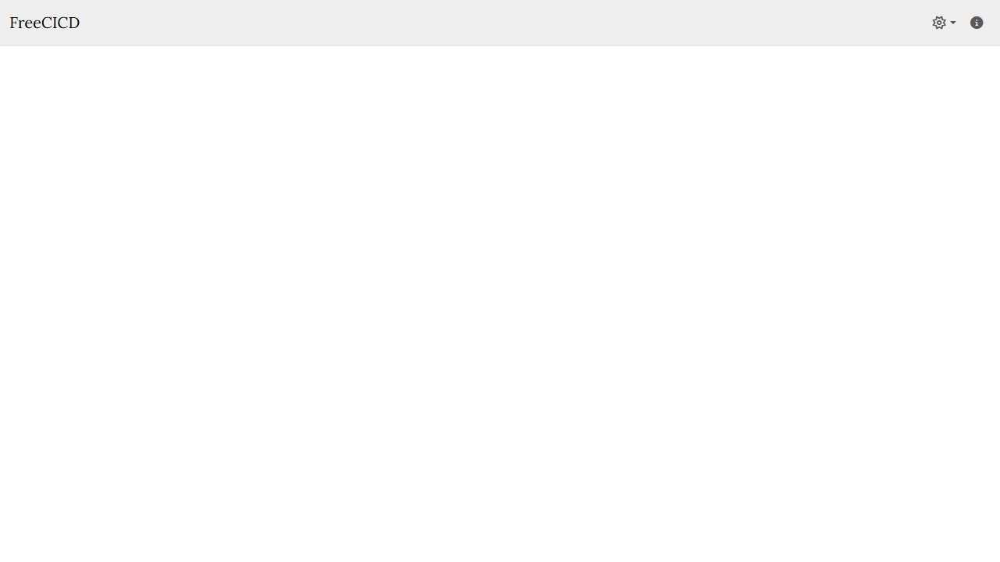
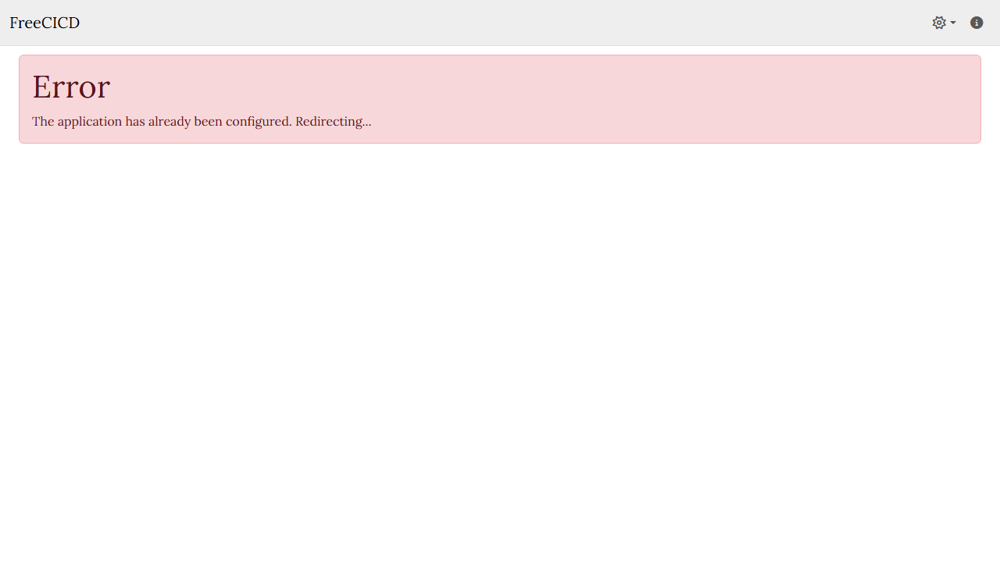

# 📊 FreeTools Workspace Report

> **Generated:** 2026-01-02 12:51:30  
> **Repository:** FreeCICD  
> **Scope:** Blazor pages only — API endpoints not included  

---

## 📑 Table of Contents

- [About This Report](#-about-this-report)
- [Workspace Overview](#-workspace-overview)
- [File Statistics](#-file-statistics)
- [Code Distribution](#-code-distribution)
- [Largest Files](#-largest-files)
- [Large File Warnings](#%EF%B8%8F-large-file-warnings)
- [Blazor Page Routes](#%EF%B8%8F-blazor-page-routes)
- [Route Map](#-route-map)
- [Screenshot Health](#-screenshot-health)
- [Screenshot Gallery](#-screenshot-gallery)

---

## 📋 About This Report

This report is auto-generated by the **WorkspaceReporter** tool pipeline.

### Scope

| Included | Not Included |
|----------|--------------|
| ✅ Blazor pages (`@page` directives) | ❌ API endpoints (`/api/*`) |
| ✅ Razor components | ❌ Dynamic routes (MapGet/MapPost) |
| ✅ C# source files | ❌ Routes with parameters (`{id}`) |
| ✅ Configuration files | |

### File Categories (Kind)

| Kind | Description |
|------|-------------|
| **RazorPage** | `.razor` file with `@page` directive (routable) |
| **RazorComponent** | `.razor` file without `@page` (reusable component) |
| **CSharpSource** | `.cs` file (classes, services, etc.) |
| **ProjectFile** | `.csproj` file (project configuration) |
| **SolutionFile** | `.sln` file (solution configuration) |
| **Config** | `.json`, `.xml`, `.yaml`, `.yml`, `.config` files |
| **Markdown** | `.md` documentation files |

---

## 📁 Workspace Overview

| Metric | Value |
|--------|-------|
| **Total Files** | 324 |
| **Total Lines** | 86,170 |
| **Total Characters** | 3,237,695 |
| **Total Size** | 3.1 MB |
| **Avg Lines/File** | 266.0 |
| **Avg Size/File** | 9.8 KB |

## 📈 File Statistics

### By Category

| Category | Count | Avg Lines | Total Lines | Percentage |
|----------|------:|----------:|------------:|------------|
| CSharpSource | 129 | 307 | 39,548 | [███████░░░░░░░░░░░░░] 39.8% |
| RazorComponent | 63 | 180 | 11,364 | [███░░░░░░░░░░░░░░░░░] 19.4% |
| Markdown | 53 | 389 | 20,638 | [███░░░░░░░░░░░░░░░░░] 16.4% |
| RazorPage | 42 | 250 | 10,486 | [██░░░░░░░░░░░░░░░░░░] 13.0% |
| Config | 21 | 179 | 3,757 | [█░░░░░░░░░░░░░░░░░░░] 6.5% |
| ProjectFile | 16 | 24 | 377 | [█░░░░░░░░░░░░░░░░░░░░] 4.9% |

### Files by Category

<details>
<summary><strong>CSharpSource</strong> (129 files)</summary>

| File | Lines | Size |
|------|------:|-----:|
| [FreeCICD.Client/DataModel.App.cs](../../../../../../FreeCICD/FreeCICD.Client/DataModel.App.cs) | 63 | 1.9 KB |
| [FreeCICD.Client/DataModel.cs](../../../../../../FreeCICD/FreeCICD.Client/DataModel.cs) | 1,990 | 66.5 KB |
| [FreeCICD.Client/Helpers.App.cs](../../../../../../FreeCICD/FreeCICD.Client/Helpers.App.cs) | 167 | 5.6 KB |
| [FreeCICD.Client/Helpers.cs](../../../../../../FreeCICD/FreeCICD.Client/Helpers.cs) | 6,010 | 221.9 KB |
| [FreeCICD.Client/Program.cs](../../../../../../FreeCICD/FreeCICD.Client/Program.cs) | 24 | 775 bytes |
| [FreeCICD.DataAccess/DataAccess.ActiveDirectory.cs](../../../../../../FreeCICD/FreeCICD.DataAccess/DataAccess.ActiveDirectory.cs) | 233 | 10.8 KB |
| [FreeCICD.DataAccess/DataAccess.Ajax.cs](../../../../../../FreeCICD/FreeCICD.DataAccess/DataAccess.Ajax.cs) | 143 | 6.4 KB |
| [FreeCICD.DataAccess/DataAccess.App.cs](../../../../../../FreeCICD/FreeCICD.DataAccess/DataAccess.App.cs) | 428 | 15.9 KB |
| [FreeCICD.DataAccess/DataAccess.ApplicationSettings.cs](../../../../../../FreeCICD/FreeCICD.DataAccess/DataAccess.ApplicationSettings.cs) | 122 | 6.1 KB |
| [FreeCICD.DataAccess/DataAccess.Authenticate.cs](../../../../../../FreeCICD/FreeCICD.DataAccess/DataAccess.Authenticate.cs) | 224 | 9.4 KB |
| [FreeCICD.DataAccess/DataAccess.cs](../../../../../../FreeCICD/FreeCICD.DataAccess/DataAccess.cs) | 159 | 6.3 KB |
| [FreeCICD.DataAccess/DataAccess.CSharpCode.cs](../../../../../../FreeCICD/FreeCICD.DataAccess/DataAccess.CSharpCode.cs) | 127 | 7.3 KB |
| [FreeCICD.DataAccess/DataAccess.Departments.cs](../../../../../../FreeCICD/FreeCICD.DataAccess/DataAccess.Departments.cs) | 526 | 22.3 KB |
| [FreeCICD.DataAccess/DataAccess.Disposable.cs](../../../../../../FreeCICD/FreeCICD.DataAccess/DataAccess.Disposable.cs) | 26 | 637 bytes |
| [FreeCICD.DataAccess/DataAccess.Encryption.cs](../../../../../../FreeCICD/FreeCICD.DataAccess/DataAccess.Encryption.cs) | 291 | 10.1 KB |
| [FreeCICD.DataAccess/DataAccess.FileStorage.cs](../../../../../../FreeCICD/FreeCICD.DataAccess/DataAccess.FileStorage.cs) | 632 | 24.5 KB |
| [FreeCICD.DataAccess/DataAccess.JWT.cs](../../../../../../FreeCICD/FreeCICD.DataAccess/DataAccess.JWT.cs) | 68 | 2.0 KB |
| [FreeCICD.DataAccess/DataAccess.Language.cs](../../../../../../FreeCICD/FreeCICD.DataAccess/DataAccess.Language.cs) | 751 | 44.5 KB |
| [FreeCICD.DataAccess/DataAccess.Migrations.cs](../../../../../../FreeCICD/FreeCICD.DataAccess/DataAccess.Migrations.cs) | 207 | 7.1 KB |
| [FreeCICD.DataAccess/DataAccess.Plugins.cs](../../../../../../FreeCICD/FreeCICD.DataAccess/DataAccess.Plugins.cs) | 226 | 8.1 KB |
| [FreeCICD.DataAccess/DataAccess.SeedTestData.cs](../../../../../../FreeCICD/FreeCICD.DataAccess/DataAccess.SeedTestData.cs) | 372 | 18.8 KB |
| [FreeCICD.DataAccess/DataAccess.Settings.cs](../../../../../../FreeCICD/FreeCICD.DataAccess/DataAccess.Settings.cs) | 604 | 24.6 KB |
| [FreeCICD.DataAccess/DataAccess.SignalR.cs](../../../../../../FreeCICD/FreeCICD.DataAccess/DataAccess.SignalR.cs) | 36 | 1.2 KB |
| [FreeCICD.DataAccess/DataAccess.Tags.cs](../../../../../../FreeCICD/FreeCICD.DataAccess/DataAccess.Tags.cs) | 264 | 9.3 KB |
| [FreeCICD.DataAccess/DataAccess.Tenants.cs](../../../../../../FreeCICD/FreeCICD.DataAccess/DataAccess.Tenants.cs) | 701 | 26.6 KB |
| [FreeCICD.DataAccess/DataAccess.UDFLabels.cs](../../../../../../FreeCICD/FreeCICD.DataAccess/DataAccess.UDFLabels.cs) | 277 | 10.4 KB |
| [FreeCICD.DataAccess/DataAccess.UserGroups.cs](../../../../../../FreeCICD/FreeCICD.DataAccess/DataAccess.UserGroups.cs) | 390 | 15.7 KB |
| [FreeCICD.DataAccess/DataAccess.Users.cs](../../../../../../FreeCICD/FreeCICD.DataAccess/DataAccess.Users.cs) | 2,558 | 105.6 KB |
| [FreeCICD.DataAccess/DataAccess.Utilities.cs](../../../../../../FreeCICD/FreeCICD.DataAccess/DataAccess.Utilities.cs) | 2,226 | 79.8 KB |
| [FreeCICD.DataAccess/DataMigrations.MySQL.cs](../../../../../../FreeCICD/FreeCICD.DataAccess/DataMigrations.MySQL.cs) | 314 | 11.8 KB |
| [FreeCICD.DataAccess/DataMigrations.PostgreSQL.cs](../../../../../../FreeCICD/FreeCICD.DataAccess/DataMigrations.PostgreSQL.cs) | 315 | 11.4 KB |
| [FreeCICD.DataAccess/DataMigrations.SQLite.cs](../../../../../../FreeCICD/FreeCICD.DataAccess/DataMigrations.SQLite.cs) | 302 | 10.3 KB |
| [FreeCICD.DataAccess/DataMigrations.SQLServer.cs](../../../../../../FreeCICD/FreeCICD.DataAccess/DataMigrations.SQLServer.cs) | 393 | 17.8 KB |
| [FreeCICD.DataAccess/FreeCICD.App.DataAccess.cs](../../../../../../FreeCICD/FreeCICD.DataAccess/FreeCICD.App.DataAccess.cs) | 69 | 6.5 KB |
| [...CD.DataAccess/FreeCICD.App.DataAccess.DevOps.Dashboard.cs](../../../../../../FreeCICD/FreeCICD.DataAccess/FreeCICD.App.DataAccess.DevOps.Dashboard.cs) | 575 | 28.7 KB |
| [...ICD.DataAccess/FreeCICD.App.DataAccess.DevOps.GitFiles.cs](../../../../../../FreeCICD/FreeCICD.DataAccess/FreeCICD.App.DataAccess.DevOps.GitFiles.cs) | 148 | 6.3 KB |
| [...CD.DataAccess/FreeCICD.App.DataAccess.DevOps.Pipelines.cs](../../../../../../FreeCICD/FreeCICD.DataAccess/FreeCICD.App.DataAccess.DevOps.Pipelines.cs) | 468 | 25.9 KB |
| [...CD.DataAccess/FreeCICD.App.DataAccess.DevOps.Resources.cs](../../../../../../FreeCICD/FreeCICD.DataAccess/FreeCICD.App.DataAccess.DevOps.Resources.cs) | 561 | 25.2 KB |
| [...D.DataAccess/FreeCICD.App.DataAccess.Import.Operations.cs](../../../../../../FreeCICD/FreeCICD.DataAccess/FreeCICD.App.DataAccess.Import.Operations.cs) | 594 | 26.1 KB |
| [...D.DataAccess/FreeCICD.App.DataAccess.Import.Validation.cs](../../../../../../FreeCICD/FreeCICD.DataAccess/FreeCICD.App.DataAccess.Import.Validation.cs) | 374 | 17.2 KB |
| [FreeCICD.DataAccess/GlobalUsings.cs](../../../../../../FreeCICD/FreeCICD.DataAccess/GlobalUsings.cs) | 16 | 511 bytes |
| [FreeCICD.DataAccess/GraphAPI.App.cs](../../../../../../FreeCICD/FreeCICD.DataAccess/GraphAPI.App.cs) | 7 | 135 bytes |
| [FreeCICD.DataAccess/GraphAPI.cs](../../../../../../FreeCICD/FreeCICD.DataAccess/GraphAPI.cs) | 166 | 6.0 KB |
| [FreeCICD.DataAccess/RandomPasswordGenerator.App.cs](../../../../../../FreeCICD/FreeCICD.DataAccess/RandomPasswordGenerator.App.cs) | 4 | 53 bytes |
| [FreeCICD.DataAccess/RandomPasswordGenerator.cs](../../../../../../FreeCICD/FreeCICD.DataAccess/RandomPasswordGenerator.cs) | 115 | 4.5 KB |
| [FreeCICD.DataAccess/Utilities.App.cs](../../../../../../FreeCICD/FreeCICD.DataAccess/Utilities.App.cs) | 6 | 113 bytes |
| [FreeCICD.DataAccess/Utilities.cs](../../../../../../FreeCICD/FreeCICD.DataAccess/Utilities.cs) | 962 | 36.3 KB |
| [FreeCICD.DataObjects/Caching.cs](../../../../../../FreeCICD/FreeCICD.DataObjects/Caching.cs) | 99 | 3.2 KB |
| [FreeCICD.DataObjects/DataObjects.ActiveDirectory.cs](../../../../../../FreeCICD/FreeCICD.DataObjects/DataObjects.ActiveDirectory.cs) | 30 | 995 bytes |
| [FreeCICD.DataObjects/DataObjects.Ajax.cs](../../../../../../FreeCICD/FreeCICD.DataObjects/DataObjects.Ajax.cs) | 23 | 682 bytes |
| [FreeCICD.DataObjects/DataObjects.App.cs](../../../../../../FreeCICD/FreeCICD.DataObjects/DataObjects.App.cs) | 16 | 322 bytes |
| [FreeCICD.DataObjects/DataObjects.cs](../../../../../../FreeCICD/FreeCICD.DataObjects/DataObjects.cs) | 648 | 24.6 KB |
| [FreeCICD.DataObjects/DataObjects.Departments.cs](../../../../../../FreeCICD/FreeCICD.DataObjects/DataObjects.Departments.cs) | 33 | 1.2 KB |
| [FreeCICD.DataObjects/DataObjects.Services.cs](../../../../../../FreeCICD/FreeCICD.DataObjects/DataObjects.Services.cs) | 23 | 825 bytes |
| [FreeCICD.DataObjects/DataObjects.SignalR.cs](../../../../../../FreeCICD/FreeCICD.DataObjects/DataObjects.SignalR.cs) | 63 | 2.1 KB |
| [FreeCICD.DataObjects/DataObjects.Tags.cs](../../../../../../FreeCICD/FreeCICD.DataObjects/DataObjects.Tags.cs) | 29 | 867 bytes |
| [FreeCICD.DataObjects/DataObjects.UDFLabels.cs](../../../../../../FreeCICD/FreeCICD.DataObjects/DataObjects.UDFLabels.cs) | 19 | 634 bytes |
| [FreeCICD.DataObjects/DataObjects.UserGroups.cs](../../../../../../FreeCICD/FreeCICD.DataObjects/DataObjects.UserGroups.cs) | 25 | 821 bytes |
| [FreeCICD.DataObjects/FreeCICD.App.DataObjects.cs](../../../../../../FreeCICD/FreeCICD.DataObjects/FreeCICD.App.DataObjects.cs) | 897 | 35.2 KB |
| [FreeCICD.DataObjects/FreeCICD.App.Settings.cs](../../../../../../FreeCICD/FreeCICD.DataObjects/FreeCICD.App.Settings.cs) | 134 | 4.8 KB |
| [FreeCICD.DataObjects/GlobalSettings.App.cs](../../../../../../FreeCICD/FreeCICD.DataObjects/GlobalSettings.App.cs) | 6 | 117 bytes |
| [FreeCICD.DataObjects/GlobalSettings.cs](../../../../../../FreeCICD/FreeCICD.DataObjects/GlobalSettings.cs) | 14 | 556 bytes |
| [FreeCICD.EFModels/Design/EFDataModelFactory.cs](../../../../../../FreeCICD/FreeCICD.EFModels/Design/EFDataModelFactory.cs) | 105 | 4.5 KB |
| [FreeCICD.EFModels/EFModelOverrides.cs](../../../../../../FreeCICD/FreeCICD.EFModels/EFModelOverrides.cs) | 29 | 1.2 KB |
| [FreeCICD.EFModels/EFModels/Department.cs](../../../../../../FreeCICD/FreeCICD.EFModels/EFModels/Department.cs) | 33 | 751 bytes |
| [FreeCICD.EFModels/EFModels/DepartmentGroup.cs](../../../../../../FreeCICD/FreeCICD.EFModels/EFModels/DepartmentGroup.cs) | 25 | 536 bytes |
| [FreeCICD.EFModels/EFModels/EFDataModel.cs](../../../../../../FreeCICD/FreeCICD.EFModels/EFModels/EFDataModel.cs) | 259 | 10.7 KB |
| [FreeCICD.EFModels/EFModels/EmailTemplate.cs](../../../../../../FreeCICD/FreeCICD.EFModels/EFModels/EmailTemplate.cs) | 29 | 607 bytes |
| [FreeCICD.EFModels/EFModels/FileStorage.cs](../../../../../../FreeCICD/FreeCICD.EFModels/EFModels/FileStorage.cs) | 39 | 826 bytes |
| [FreeCICD.EFModels/EFModels/PluginCache.cs](../../../../../../FreeCICD/FreeCICD.EFModels/EFModels/PluginCache.cs) | 31 | 629 bytes |
| [FreeCICD.EFModels/EFModels/Setting.cs](../../../../../../FreeCICD/FreeCICD.EFModels/EFModels/Setting.cs) | 25 | 530 bytes |
| [FreeCICD.EFModels/EFModels/Tag.cs](../../../../../../FreeCICD/FreeCICD.EFModels/EFModels/Tag.cs) | 37 | 816 bytes |
| [FreeCICD.EFModels/EFModels/TagItem.cs](../../../../../../FreeCICD/FreeCICD.EFModels/EFModels/TagItem.cs) | 17 | 327 bytes |
| [FreeCICD.EFModels/EFModels/Tenant.cs](../../../../../../FreeCICD/FreeCICD.EFModels/EFModels/Tenant.cs) | 27 | 558 bytes |
| [FreeCICD.EFModels/EFModels/UDFLabel.cs](../../../../../../FreeCICD/FreeCICD.EFModels/EFModels/UDFLabel.cs) | 27 | 563 bytes |
| [FreeCICD.EFModels/EFModels/User.cs](../../../../../../FreeCICD/FreeCICD.EFModels/EFModels/User.cs) | 98 | 2.1 KB |
| [FreeCICD.EFModels/EFModels/UserGroup.cs](../../../../../../FreeCICD/FreeCICD.EFModels/EFModels/UserGroup.cs) | 31 | 694 bytes |
| [FreeCICD.EFModels/EFModels/UserInGroup.cs](../../../../../../FreeCICD/FreeCICD.EFModels/EFModels/UserInGroup.cs) | 19 | 398 bytes |
| [FreeCICD.EFModels/Migrations/20251210180351_Initial.cs](../../../../../../FreeCICD/FreeCICD.EFModels/Migrations/20251210180351_Initial.cs) | 384 | 21.3 KB |
| [...CD.EFModels/Migrations/20251210180351_Initial.Designer.cs](../../../../../../FreeCICD/FreeCICD.EFModels/Migrations/20251210180351_Initial.Designer.cs) | 727 | 25.4 KB |
| [FreeCICD.EFModels/Migrations/EFDataModelModelSnapshot.cs](../../../../../../FreeCICD/FreeCICD.EFModels/Migrations/EFDataModelModelSnapshot.cs) | 724 | 25.3 KB |
| [FreeCICD.Plugins/Encryption.cs](../../../../../../FreeCICD/FreeCICD.Plugins/Encryption.cs) | 377 | 13.5 KB |
| [FreeCICD.Plugins/Plugins.cs](../../../../../../FreeCICD/FreeCICD.Plugins/Plugins.cs) | 818 | 32.1 KB |
| [FreeCICD/Classes/ConfigurationHelper.App.cs](../../../../../../FreeCICD/FreeCICD/Classes/ConfigurationHelper.App.cs) | 25 | 512 bytes |
| [FreeCICD/Classes/ConfigurationHelper.cs](../../../../../../FreeCICD/FreeCICD/Classes/ConfigurationHelper.cs) | 72 | 1.9 KB |
| [FreeCICD/Classes/CustomAuthenticationHandler.cs](../../../../../../FreeCICD/FreeCICD/Classes/CustomAuthenticationHandler.cs) | 87 | 3.3 KB |
| [FreeCICD/Classes/CustomAuthIdentity.cs](../../../../../../FreeCICD/FreeCICD/Classes/CustomAuthIdentity.cs) | 229 | 8.6 KB |
| [FreeCICD/Classes/FreeCICD.App.Config.cs](../../../../../../FreeCICD/FreeCICD/Classes/FreeCICD.App.Config.cs) | 53 | 1.1 KB |
| [FreeCICD/Classes/RouteHelper.cs](../../../../../../FreeCICD/FreeCICD/Classes/RouteHelper.cs) | 99 | 2.5 KB |
| [FreeCICD/Controllers/AuthorizationController.cs](../../../../../../FreeCICD/FreeCICD/Controllers/AuthorizationController.cs) | 380 | 14.6 KB |
| [FreeCICD/Controllers/DataController.Ajax.cs](../../../../../../FreeCICD/FreeCICD/Controllers/DataController.Ajax.cs) | 16 | 427 bytes |
| [FreeCICD/Controllers/DataController.App.cs](../../../../../../FreeCICD/FreeCICD/Controllers/DataController.App.cs) | 34 | 1.0 KB |
| [FreeCICD/Controllers/DataController.ApplicationSettings.cs](../../../../../../FreeCICD/FreeCICD/Controllers/DataController.ApplicationSettings.cs) | 25 | 792 bytes |
| [FreeCICD/Controllers/DataController.Authenticate.cs](../../../../../../FreeCICD/FreeCICD/Controllers/DataController.Authenticate.cs) | 29 | 1.0 KB |
| [FreeCICD/Controllers/DataController.cs](../../../../../../FreeCICD/FreeCICD/Controllers/DataController.cs) | 132 | 4.9 KB |
| [FreeCICD/Controllers/DataController.Departments.cs](../../../../../../FreeCICD/FreeCICD/Controllers/DataController.Departments.cs) | 79 | 2.5 KB |
| [FreeCICD/Controllers/DataController.Encryption.cs](../../../../../../FreeCICD/FreeCICD/Controllers/DataController.Encryption.cs) | 89 | 2.6 KB |
| [FreeCICD/Controllers/DataController.FileStorage.cs](../../../../../../FreeCICD/FreeCICD/Controllers/DataController.FileStorage.cs) | 186 | 6.1 KB |
| [FreeCICD/Controllers/DataController.Language.cs](../../../../../../FreeCICD/FreeCICD/Controllers/DataController.Language.cs) | 50 | 1.5 KB |
| [FreeCICD/Controllers/DataController.Plugins.cs](../../../../../../FreeCICD/FreeCICD/Controllers/DataController.Plugins.cs) | 17 | 431 bytes |
| [FreeCICD/Controllers/DataController.Tags.cs](../../../../../../FreeCICD/FreeCICD/Controllers/DataController.Tags.cs) | 43 | 1.2 KB |
| [FreeCICD/Controllers/DataController.Tenants.cs](../../../../../../FreeCICD/FreeCICD/Controllers/DataController.Tenants.cs) | 109 | 3.2 KB |
| [FreeCICD/Controllers/DataController.UDF.cs](../../../../../../FreeCICD/FreeCICD/Controllers/DataController.UDF.cs) | 25 | 752 bytes |
| [FreeCICD/Controllers/DataController.UserGroups.cs](../../../../../../FreeCICD/FreeCICD/Controllers/DataController.UserGroups.cs) | 43 | 1.3 KB |
| [FreeCICD/Controllers/DataController.Users.cs](../../../../../../FreeCICD/FreeCICD/Controllers/DataController.Users.cs) | 230 | 7.2 KB |
| [FreeCICD/Controllers/DataController.Utilities.cs](../../../../../../FreeCICD/FreeCICD/Controllers/DataController.Utilities.cs) | 218 | 6.9 KB |
| [FreeCICD/Controllers/FreeCICD.App.API.cs](../../../../../../FreeCICD/FreeCICD/Controllers/FreeCICD.App.API.cs) | 528 | 24.9 KB |
| [FreeCICD/Controllers/SetupController.cs](../../../../../../FreeCICD/FreeCICD/Controllers/SetupController.cs) | 144 | 7.0 KB |
| [FreeCICD/FreeCICD.App.Program.cs](../../../../../../FreeCICD/FreeCICD/FreeCICD.App.Program.cs) | 24 | 938 bytes |
| [FreeCICD/Hubs/signalrHub.cs](../../../../../../FreeCICD/FreeCICD/Hubs/signalrHub.cs) | 45 | 1.4 KB |
| [FreeCICD/Plugins/Example1.cs](../../../../../../FreeCICD/FreeCICD/Plugins/Example1.cs) | 343 | 16.0 KB |
| [FreeCICD/Plugins/Example2.cs](../../../../../../FreeCICD/FreeCICD/Plugins/Example2.cs) | 35 | 1.2 KB |
| [FreeCICD/Plugins/Example3.cs](../../../../../../FreeCICD/FreeCICD/Plugins/Example3.cs) | 49 | 1.7 KB |
| [FreeCICD/Plugins/LoginWithPrompts.cs](../../../../../../FreeCICD/FreeCICD/Plugins/LoginWithPrompts.cs) | 218 | 9.3 KB |
| [FreeCICD/Plugins/UserUpdate.cs](../../../../../../FreeCICD/FreeCICD/Plugins/UserUpdate.cs) | 50 | 1.8 KB |
| [FreeCICD/PluginsInterfaces.cs](../../../../../../FreeCICD/FreeCICD/PluginsInterfaces.cs) | 56 | 1.6 KB |
| [FreeCICD/Program.App.cs](../../../../../../FreeCICD/FreeCICD/Program.App.cs) | 54 | 1.5 KB |
| [FreeCICD/Program.cs](../../../../../../FreeCICD/FreeCICD/Program.cs) | 221 | 10.5 KB |
| [FreeTools/FreeTools.AppHost/Program.cs](../../../../../../FreeCICD/FreeTools/FreeTools.AppHost/Program.cs) | 297 | 13.4 KB |
| [FreeTools/FreeTools.BrowserSnapshot/Program.cs](../../../../../../FreeCICD/FreeTools/FreeTools.BrowserSnapshot/Program.cs) | 861 | 31.3 KB |
| [FreeTools/FreeTools.Core/CliArgs.cs](../../../../../../FreeCICD/FreeTools/FreeTools.Core/CliArgs.cs) | 100 | 3.1 KB |
| [FreeTools/FreeTools.Core/ConsoleOutput.cs](../../../../../../FreeCICD/FreeTools/FreeTools.Core/ConsoleOutput.cs) | 72 | 2.2 KB |
| [FreeTools/FreeTools.Core/PathSanitizer.cs](../../../../../../FreeCICD/FreeTools/FreeTools.Core/PathSanitizer.cs) | 54 | 1.6 KB |
| [FreeTools/FreeTools.Core/RouteParser.cs](../../../../../../FreeCICD/FreeTools/FreeTools.Core/RouteParser.cs) | 155 | 5.4 KB |
| [FreeTools/FreeTools.EndpointMapper/Program.cs](../../../../../../FreeCICD/FreeTools/FreeTools.EndpointMapper/Program.cs) | 176 | 6.3 KB |
| [FreeTools/FreeTools.EndpointPoker/Program.cs](../../../../../../FreeCICD/FreeTools/FreeTools.EndpointPoker/Program.cs) | 312 | 10.1 KB |
| [FreeTools/FreeTools.ForkCRM/Program.cs](../../../../../../FreeCICD/FreeTools/FreeTools.ForkCRM/Program.cs) | 445 | 17.1 KB |
| [FreeTools/FreeTools.WorkspaceInventory/Program.cs](../../../../../../FreeCICD/FreeTools/FreeTools.WorkspaceInventory/Program.cs) | 566 | 21.0 KB |
| [FreeTools/FreeTools.WorkspaceReporter/Program.cs](../../../../../../FreeCICD/FreeTools/FreeTools.WorkspaceReporter/Program.cs) | 1,319 | 54.4 KB |

</details>

<details>
<summary><strong>RazorComponent</strong> (63 files)</summary>

| File | Lines | Size |
|------|------:|-----:|
| [FreeCICD.Client/_Imports.razor](../../../../../../FreeCICD/FreeCICD.Client/_Imports.razor) | 15 | 518 bytes |
| [FreeCICD.Client/Layout/MainLayout.razor](../../../../../../FreeCICD/FreeCICD.Client/Layout/MainLayout.razor) | 885 | 34.6 KB |
| [FreeCICD.Client/Pages/Settings/Files/ManageFile.razor](../../../../../../FreeCICD/FreeCICD.Client/Pages/Settings/Files/ManageFile.razor) | 187 | 5.4 KB |
| [FreeCICD.Client/Routes.razor](../../../../../../FreeCICD/FreeCICD.Client/Routes.razor) | 6 | 360 bytes |
| [FreeCICD.Client/Shared/AppComponents/About.App.razor](../../../../../../FreeCICD/FreeCICD.Client/Shared/AppComponents/About.App.razor) | 54 | 1.3 KB |
| [...ICD.Client/Shared/AppComponents/EditAppointment.App.razor](../../../../../../FreeCICD/FreeCICD.Client/Shared/AppComponents/EditAppointment.App.razor) | 14 | 168 bytes |
| [...CICD.Client/Shared/AppComponents/EditDepartment.App.razor](../../../../../../FreeCICD/FreeCICD.Client/Shared/AppComponents/EditDepartment.App.razor) | 57 | 1.6 KB |
| [...Client/Shared/AppComponents/EditDepartmentGroup.App.razor](../../../../../../FreeCICD/FreeCICD.Client/Shared/AppComponents/EditDepartmentGroup.App.razor) | 57 | 1.6 KB |
| [FreeCICD.Client/Shared/AppComponents/EditTag.App.razor](../../../../../../FreeCICD/FreeCICD.Client/Shared/AppComponents/EditTag.App.razor) | 78 | 2.3 KB |
| [FreeCICD.Client/Shared/AppComponents/EditTenant.App.razor](../../../../../../FreeCICD/FreeCICD.Client/Shared/AppComponents/EditTenant.App.razor) | 66 | 1.9 KB |
| [FreeCICD.Client/Shared/AppComponents/EditUser.App.razor](../../../../../../FreeCICD/FreeCICD.Client/Shared/AppComponents/EditUser.App.razor) | 71 | 2.3 KB |
| [...d/AppComponents/FreeCICD.App.UI.Dashboard.FilterBar.razor](../../../../../../FreeCICD/FreeCICD.Client/Shared/AppComponents/FreeCICD.App.UI.Dashboard.FilterBar.razor) | 182 | 7.4 KB |
| [...ppComponents/FreeCICD.App.UI.Dashboard.PipelineCard.razor](../../../../../../FreeCICD/FreeCICD.Client/Shared/AppComponents/FreeCICD.App.UI.Dashboard.PipelineCard.razor) | 411 | 16.7 KB |
| [...pComponents/FreeCICD.App.UI.Dashboard.PipelineGroup.razor](../../../../../../FreeCICD/FreeCICD.Client/Shared/AppComponents/FreeCICD.App.UI.Dashboard.PipelineGroup.razor) | 139 | 5.1 KB |
| [...d/AppComponents/FreeCICD.App.UI.Dashboard.Pipelines.razor](../../../../../../FreeCICD/FreeCICD.Client/Shared/AppComponents/FreeCICD.App.UI.Dashboard.Pipelines.razor) | 758 | 30.2 KB |
| [...d/AppComponents/FreeCICD.App.UI.Dashboard.TableView.razor](../../../../../../FreeCICD/FreeCICD.Client/Shared/AppComponents/FreeCICD.App.UI.Dashboard.TableView.razor) | 537 | 25.2 KB |
| [...Components/FreeCICD.App.UI.Dashboard.VarGroupBadges.razor](../../../../../../FreeCICD/FreeCICD.Client/Shared/AppComponents/FreeCICD.App.UI.Dashboard.VarGroupBadges.razor) | 165 | 5.1 KB |
| [...ppComponents/FreeCICD.App.UI.Dashboard.ViewControls.razor](../../../../../../FreeCICD/FreeCICD.Client/Shared/AppComponents/FreeCICD.App.UI.Dashboard.ViewControls.razor) | 119 | 5.1 KB |
| [....Client/Shared/AppComponents/FreeCICD.App.UI.Import.razor](../../../../../../FreeCICD/FreeCICD.Client/Shared/AppComponents/FreeCICD.App.UI.Import.razor) | 752 | 27.1 KB |
| [....Client/Shared/AppComponents/FreeCICD.App.UI.Wizard.razor](../../../../../../FreeCICD/FreeCICD.Client/Shared/AppComponents/FreeCICD.App.UI.Wizard.razor) | 1,311 | 69.5 KB |
| [FreeCICD.Client/Shared/AppComponents/Index.App.razor](../../../../../../FreeCICD/FreeCICD.Client/Shared/AppComponents/Index.App.razor) | 3 | 165 bytes |
| [FreeCICD.Client/Shared/AppComponents/Pipelines.App.razor](../../../../../../FreeCICD/FreeCICD.Client/Shared/AppComponents/Pipelines.App.razor) | 3 | 161 bytes |
| [FreeCICD.Client/Shared/AppComponents/Settings.App.razor](../../../../../../FreeCICD/FreeCICD.Client/Shared/AppComponents/Settings.App.razor) | 110 | 3.3 KB |
| [FreeCICD.Client/Shared/BranchBadge.razor](../../../../../../FreeCICD/FreeCICD.Client/Shared/BranchBadge.razor) | 64 | 2.3 KB |
| [FreeCICD.Client/Shared/GeneratePasswordDialog.razor](../../../../../../FreeCICD/FreeCICD.Client/Shared/GeneratePasswordDialog.razor) | 74 | 2.5 KB |
| [FreeCICD.Client/Shared/GetInputDialog.razor](../../../../../../FreeCICD/FreeCICD.Client/Shared/GetInputDialog.razor) | 96 | 2.8 KB |
| [FreeCICD.Client/Shared/Highcharts.razor](../../../../../../FreeCICD/FreeCICD.Client/Shared/Highcharts.razor) | 235 | 6.8 KB |
| [FreeCICD.Client/Shared/HtmlEditorDialog.razor](../../../../../../FreeCICD/FreeCICD.Client/Shared/HtmlEditorDialog.razor) | 95 | 3.0 KB |
| [FreeCICD.Client/Shared/Icon.razor](../../../../../../FreeCICD/FreeCICD.Client/Shared/Icon.razor) | 73 | 2.1 KB |
| [FreeCICD.Client/Shared/Language.razor](../../../../../../FreeCICD/FreeCICD.Client/Shared/Language.razor) | 121 | 3.7 KB |
| [FreeCICD.Client/Shared/LastModifiedMessage.razor](../../../../../../FreeCICD/FreeCICD.Client/Shared/LastModifiedMessage.razor) | 60 | 2.3 KB |
| [FreeCICD.Client/Shared/LoadingMessage.razor](../../../../../../FreeCICD/FreeCICD.Client/Shared/LoadingMessage.razor) | 2 | 95 bytes |
| [FreeCICD.Client/Shared/ModalMessage.razor](../../../../../../FreeCICD/FreeCICD.Client/Shared/ModalMessage.razor) | 15 | 327 bytes |
| [FreeCICD.Client/Shared/MonacoEditor.razor](../../../../../../FreeCICD/FreeCICD.Client/Shared/MonacoEditor.razor) | 487 | 17.9 KB |
| [FreeCICD.Client/Shared/NavigationMenu.razor](../../../../../../FreeCICD/FreeCICD.Client/Shared/NavigationMenu.razor) | 370 | 16.5 KB |
| [FreeCICD.Client/Shared/OffcanvasPopoutMenu.razor](../../../../../../FreeCICD/FreeCICD.Client/Shared/OffcanvasPopoutMenu.razor) | 331 | 13.6 KB |
| [FreeCICD.Client/Shared/PDF_Viewer.razor](../../../../../../FreeCICD/FreeCICD.Client/Shared/PDF_Viewer.razor) | 37 | 912 bytes |
| [FreeCICD.Client/Shared/PluginPrompts.razor](../../../../../../FreeCICD/FreeCICD.Client/Shared/PluginPrompts.razor) | 969 | 44.5 KB |
| [FreeCICD.Client/Shared/RenderFiles.razor](../../../../../../FreeCICD/FreeCICD.Client/Shared/RenderFiles.razor) | 93 | 3.6 KB |
| [FreeCICD.Client/Shared/RequiredIndicator.razor](../../../../../../FreeCICD/FreeCICD.Client/Shared/RequiredIndicator.razor) | 4 | 122 bytes |
| [FreeCICD.Client/Shared/SelectFile.razor](../../../../../../FreeCICD/FreeCICD.Client/Shared/SelectFile.razor) | 156 | 4.7 KB |
| [FreeCICD.Client/Shared/StickyMenuIcon.razor](../../../../../../FreeCICD/FreeCICD.Client/Shared/StickyMenuIcon.razor) | 28 | 713 bytes |
| [FreeCICD.Client/Shared/TagSelector.razor](../../../../../../FreeCICD/FreeCICD.Client/Shared/TagSelector.razor) | 272 | 8.0 KB |
| [FreeCICD.Client/Shared/Tooltip.razor](../../../../../../FreeCICD/FreeCICD.Client/Shared/Tooltip.razor) | 35 | 853 bytes |
| [FreeCICD.Client/Shared/UndeleteMessage.razor](../../../../../../FreeCICD/FreeCICD.Client/Shared/UndeleteMessage.razor) | 66 | 2.2 KB |
| [FreeCICD.Client/Shared/UploadFile.razor](../../../../../../FreeCICD/FreeCICD.Client/Shared/UploadFile.razor) | 138 | 4.4 KB |
| [FreeCICD.Client/Shared/UserDefinedFields.razor](../../../../../../FreeCICD/FreeCICD.Client/Shared/UserDefinedFields.razor) | 144 | 5.1 KB |
| [...ared/Wizard/FreeCICD.App.UI.Wizard.LoadingIndicator.razor](../../../../../../FreeCICD/FreeCICD.Client/Shared/Wizard/FreeCICD.App.UI.Wizard.LoadingIndicator.razor) | 47 | 1.6 KB |
| [...ent/Shared/Wizard/FreeCICD.App.UI.Wizard.StepBranch.razor](../../../../../../FreeCICD/FreeCICD.Client/Shared/Wizard/FreeCICD.App.UI.Wizard.StepBranch.razor) | 20 | 889 bytes |
| [.../Shared/Wizard/FreeCICD.App.UI.Wizard.StepCompleted.razor](../../../../../../FreeCICD/FreeCICD.Client/Shared/Wizard/FreeCICD.App.UI.Wizard.StepCompleted.razor) | 231 | 10.5 KB |
| [...ent/Shared/Wizard/FreeCICD.App.UI.Wizard.StepCsproj.razor](../../../../../../FreeCICD/FreeCICD.Client/Shared/Wizard/FreeCICD.App.UI.Wizard.StepCsproj.razor) | 35 | 1.3 KB |
| [...ared/Wizard/FreeCICD.App.UI.Wizard.StepEnvironments.razor](../../../../../../FreeCICD/FreeCICD.Client/Shared/Wizard/FreeCICD.App.UI.Wizard.StepEnvironments.razor) | 184 | 10.4 KB |
| [...ent/Shared/Wizard/FreeCICD.App.UI.Wizard.StepHeader.razor](../../../../../../FreeCICD/FreeCICD.Client/Shared/Wizard/FreeCICD.App.UI.Wizard.StepHeader.razor) | 88 | 3.5 KB |
| [...Client/Shared/Wizard/FreeCICD.App.UI.Wizard.StepPAT.razor](../../../../../../FreeCICD/FreeCICD.Client/Shared/Wizard/FreeCICD.App.UI.Wizard.StepPAT.razor) | 48 | 1.7 KB |
| [...Client/Shared/Wizard/FreeCICD.App.UI.Wizard.Stepper.razor](../../../../../../FreeCICD/FreeCICD.Client/Shared/Wizard/FreeCICD.App.UI.Wizard.Stepper.razor) | 90 | 3.6 KB |
| [...t/Shared/Wizard/FreeCICD.App.UI.Wizard.StepPipeline.razor](../../../../../../FreeCICD/FreeCICD.Client/Shared/Wizard/FreeCICD.App.UI.Wizard.StepPipeline.razor) | 54 | 2.1 KB |
| [...nt/Shared/Wizard/FreeCICD.App.UI.Wizard.StepPreview.razor](../../../../../../FreeCICD/FreeCICD.Client/Shared/Wizard/FreeCICD.App.UI.Wizard.StepPreview.razor) | 48 | 1.7 KB |
| [...nt/Shared/Wizard/FreeCICD.App.UI.Wizard.StepProject.razor](../../../../../../FreeCICD/FreeCICD.Client/Shared/Wizard/FreeCICD.App.UI.Wizard.StepProject.razor) | 20 | 863 bytes |
| [...Shared/Wizard/FreeCICD.App.UI.Wizard.StepRepository.razor](../../../../../../FreeCICD/FreeCICD.Client/Shared/Wizard/FreeCICD.App.UI.Wizard.StepRepository.razor) | 20 | 887 bytes |
| [...Client/Shared/Wizard/FreeCICD.App.UI.Wizard.Summary.razor](../../../../../../FreeCICD/FreeCICD.Client/Shared/Wizard/FreeCICD.App.UI.Wizard.Summary.razor) | 38 | 1.4 KB |
| [FreeCICD/Components/_Imports.razor](../../../../../../FreeCICD/FreeCICD/Components/_Imports.razor) | 11 | 397 bytes |
| [FreeCICD/Components/App.razor](../../../../../../FreeCICD/FreeCICD/Components/App.razor) | 433 | 17.7 KB |
| [FreeCICD/Components/Modules.App.razor](../../../../../../FreeCICD/FreeCICD/Components/Modules.App.razor) | 52 | 1.8 KB |

</details>

<details>
<summary><strong>Markdown</strong> (53 files)</summary>

| File | Lines | Size |
|------|------:|-----:|
| [docs/000_quickstart.md](../../../../../../FreeCICD/docs/000_quickstart.md) | 263 | 6.9 KB |
| [docs/001_roleplay.md](../../../../../../FreeCICD/docs/001_roleplay.md) | 244 | 5.8 KB |
| [docs/002_docsguide.md](../../../../../../FreeCICD/docs/002_docsguide.md) | 234 | 5.2 KB |
| [docs/003_templates.md](../../../../../../FreeCICD/docs/003_templates.md) | 693 | 11.7 KB |
| [docs/004_meeting_focus_group_planning.md](../../../../../../FreeCICD/docs/004_meeting_focus_group_planning.md) | 120 | 4.2 KB |
| [docs/005_meeting_dataaccess_method_catalog.md](../../../../../../FreeCICD/docs/005_meeting_dataaccess_method_catalog.md) | 250 | 10.6 KB |
| [docs/006_meeting_dataaccess_split_plan.md](../../../../../../FreeCICD/docs/006_meeting_dataaccess_split_plan.md) | 471 | 15.6 KB |
| [docs/007_project_plan_file_naming_migration.md](../../../../../../FreeCICD/docs/007_project_plan_file_naming_migration.md) | 185 | 8.3 KB |
| [FREECICD_MIGRATION_PLAN.md](../../../../../../FreeCICD/FREECICD_MIGRATION_PLAN.md) | 783 | 21.9 KB |
| [FREECICD_MIGRATION_README.md](../../../../../../FreeCICD/FREECICD_MIGRATION_README.md) | 511 | 23.1 KB |
| [FreeCICD.Client/README.md](../../../../../../FreeCICD/FreeCICD.Client/README.md) | 453 | 16.1 KB |
| [FreeCICD.DataAccess/README.md](../../../../../../FreeCICD/FreeCICD.DataAccess/README.md) | 436 | 20.2 KB |
| [FreeCICD.DataObjects/README.md](../../../../../../FreeCICD/FreeCICD.DataObjects/README.md) | 414 | 14.1 KB |
| [FreeCICD.EFModels/README.md](../../../../../../FreeCICD/FreeCICD.EFModels/README.md) | 426 | 14.0 KB |
| [FreeCICD.Plugins/README.md](../../../../../../FreeCICD/FreeCICD.Plugins/README.md) | 489 | 17.7 KB |
| [FreeCICD/Plugins/Plugins.md](../../../../../../FreeCICD/FreeCICD/Plugins/Plugins.md) | 229 | 11.3 KB |
| [FreeCICD/README.md](../../../../../../FreeCICD/FreeCICD/README.md) | 444 | 19.5 KB |
| [FreeTools/Docs/000_overview.md](../../../../../../FreeCICD/FreeTools/Docs/000_overview.md) | 287 | 11.6 KB |
| [FreeTools/Docs/001_style_guide.md](../../../../../../FreeCICD/FreeTools/Docs/001_style_guide.md) | 324 | 8.0 KB |
| [FreeTools/Docs/002_security.md](../../../../../../FreeCICD/FreeTools/Docs/002_security.md) | 175 | 4.6 KB |
| [FreeTools/Docs/003_shared_code.md](../../../../../../FreeCICD/FreeTools/Docs/003_shared_code.md) | 256 | 7.1 KB |
| [FreeTools/Docs/Guides/000_quickstart.md](../../../../../../FreeCICD/FreeTools/Docs/Guides/000_quickstart.md) | 257 | 6.2 KB |
| [FreeTools/Docs/Guides/001_roleplay.md](../../../../../../FreeCICD/FreeTools/Docs/Guides/001_roleplay.md) | 266 | 6.5 KB |
| [FreeTools/Docs/Guides/002_docsguide.md](../../../../../../FreeCICD/FreeTools/Docs/Guides/002_docsguide.md) | 236 | 5.3 KB |
| [FreeTools/Docs/Guides/003_templates.md](../../../../../../FreeCICD/FreeTools/Docs/Guides/003_templates.md) | 708 | 12.3 KB |
| [FreeTools/Docs/Guides/004_styleguide.md](../../../../../../FreeCICD/FreeTools/Docs/Guides/004_styleguide.md) | 1,871 | 49.0 KB |
| [FreeTools/Docs/Guides/005_style.comments.md](../../../../../../FreeCICD/FreeTools/Docs/Guides/005_style.comments.md) | 427 | 10.0 KB |
| [FreeTools/Docs/Guides/005_style.md](../../../../../../FreeCICD/FreeTools/Docs/Guides/005_style.md) | 94 | 2.9 KB |
| [FreeTools/Docs/Guides/006_architecture.freecrm_overview.md](../../../../../../FreeCICD/FreeTools/Docs/Guides/006_architecture.freecrm_overview.md) | 667 | 21.0 KB |
| [FreeTools/Docs/Guides/006_architecture.md](../../../../../../FreeCICD/FreeTools/Docs/Guides/006_architecture.md) | 74 | 2.5 KB |
| [FreeTools/Docs/Guides/006_architecture.unique_features.md](../../../../../../FreeCICD/FreeTools/Docs/Guides/006_architecture.unique_features.md) | 275 | 8.7 KB |
| [FreeTools/Docs/Guides/007_patterns.helpers.md](../../../../../../FreeCICD/FreeTools/Docs/Guides/007_patterns.helpers.md) | 859 | 22.9 KB |
| [FreeTools/Docs/Guides/007_patterns.md](../../../../../../FreeCICD/FreeTools/Docs/Guides/007_patterns.md) | 83 | 2.2 KB |
| [FreeTools/Docs/Guides/007_patterns.signalr.md](../../../../../../FreeCICD/FreeTools/Docs/Guides/007_patterns.signalr.md) | 551 | 15.1 KB |
| [FreeTools/Docs/Guides/008_components.highcharts.md](../../../../../../FreeCICD/FreeTools/Docs/Guides/008_components.highcharts.md) | 599 | 17.1 KB |
| [FreeTools/Docs/Guides/008_components.md](../../../../../../FreeCICD/FreeTools/Docs/Guides/008_components.md) | 159 | 4.7 KB |
| [FreeTools/Docs/Guides/008_components.monaco.md](../../../../../../FreeCICD/FreeTools/Docs/Guides/008_components.monaco.md) | 1,058 | 33.1 KB |
| [FreeTools/Docs/Guides/008_components.network_chart.md](../../../../../../FreeCICD/FreeTools/Docs/Guides/008_components.network_chart.md) | 708 | 19.2 KB |
| [FreeTools/Docs/Guides/008_components.razor_templates.md](../../../../../../FreeCICD/FreeTools/Docs/Guides/008_components.razor_templates.md) | 1,070 | 41.2 KB |
| [FreeTools/Docs/Guides/008_components.signature.md](../../../../../../FreeCICD/FreeTools/Docs/Guides/008_components.signature.md) | 495 | 12.0 KB |
| [FreeTools/Docs/Guides/008_components.wizard.md](../../../../../../FreeCICD/FreeTools/Docs/Guides/008_components.wizard.md) | 691 | 22.8 KB |
| [FreeTools/Docs/README.md](../../../../../../FreeCICD/FreeTools/Docs/README.md) | 200 | 6.4 KB |
| [FreeTools/FreeCRM-utilities/README.md](../../../../../../FreeCICD/FreeTools/FreeCRM-utilities/README.md) | 109 | 3.4 KB |
| [FreeTools/FreeTools.AppHost/README.md](../../../../../../FreeCICD/FreeTools/FreeTools.AppHost/README.md) | 224 | 7.7 KB |
| [FreeTools/FreeTools.BrowserSnapshot/README.md](../../../../../../FreeCICD/FreeTools/FreeTools.BrowserSnapshot/README.md) | 224 | 7.7 KB |
| [FreeTools/FreeTools.Core/README.md](../../../../../../FreeCICD/FreeTools/FreeTools.Core/README.md) | 157 | 4.1 KB |
| [FreeTools/FreeTools.EndpointMapper/README.md](../../../../../../FreeCICD/FreeTools/FreeTools.EndpointMapper/README.md) | 106 | 3.9 KB |
| [FreeTools/FreeTools.EndpointPoker/README.md](../../../../../../FreeCICD/FreeTools/FreeTools.EndpointPoker/README.md) | 101 | 3.8 KB |
| [FreeTools/FreeTools.WorkspaceInventory/README.md](../../../../../../FreeCICD/FreeTools/FreeTools.WorkspaceInventory/README.md) | 274 | 8.5 KB |
| [FreeTools/FreeTools.WorkspaceReporter/README.md](../../../../../../FreeCICD/FreeTools/FreeTools.WorkspaceReporter/README.md) | 198 | 8.3 KB |
| [FreeTools/README.md](../../../../../../FreeCICD/FreeTools/README.md) | 162 | 6.5 KB |
| [README.md](../../../../../../FreeCICD/README.md) | 48 | 1.6 KB |
| [Templates/README.md](../../../../../../FreeCICD/Templates/README.md) | 0 | 0 bytes |

</details>

<details>
<summary><strong>RazorPage</strong> (42 files)</summary>

| File | Lines | Size |
|------|------:|-----:|
| [FreeCICD.Client/Pages/About.razor](../../../../../../FreeCICD/FreeCICD.Client/Pages/About.razor) | 51 | 1.2 KB |
| [FreeCICD.Client/Pages/App/FreeCICD.App.Pages.Pipelines.razor](../../../../../../FreeCICD/FreeCICD.Client/Pages/App/FreeCICD.App.Pages.Pipelines.razor) | 53 | 1.3 KB |
| [FreeCICD.Client/Pages/Authorization/AccessDenied.razor](../../../../../../FreeCICD/FreeCICD.Client/Pages/Authorization/AccessDenied.razor) | 70 | 1.8 KB |
| [FreeCICD.Client/Pages/Authorization/InvalidUser.razor](../../../../../../FreeCICD/FreeCICD.Client/Pages/Authorization/InvalidUser.razor) | 56 | 1.4 KB |
| [FreeCICD.Client/Pages/Authorization/Login.razor](../../../../../../FreeCICD/FreeCICD.Client/Pages/Authorization/Login.razor) | 1,254 | 48.6 KB |
| [FreeCICD.Client/Pages/Authorization/Logout.razor](../../../../../../FreeCICD/FreeCICD.Client/Pages/Authorization/Logout.razor) | 96 | 3.4 KB |
| [FreeCICD.Client/Pages/Authorization/NoLocalAccount.razor](../../../../../../FreeCICD/FreeCICD.Client/Pages/Authorization/NoLocalAccount.razor) | 60 | 1.5 KB |
| [FreeCICD.Client/Pages/Authorization/ProcessLogin.razor](../../../../../../FreeCICD/FreeCICD.Client/Pages/Authorization/ProcessLogin.razor) | 39 | 1.1 KB |
| [FreeCICD.Client/Pages/ChangePassword.razor](../../../../../../FreeCICD/FreeCICD.Client/Pages/ChangePassword.razor) | 228 | 7.7 KB |
| [FreeCICD.Client/Pages/DatabaseOffline.razor](../../../../../../FreeCICD/FreeCICD.Client/Pages/DatabaseOffline.razor) | 60 | 1.6 KB |
| [FreeCICD.Client/Pages/Index.razor](../../../../../../FreeCICD/FreeCICD.Client/Pages/Index.razor) | 50 | 1.2 KB |
| [FreeCICD.Client/Pages/NotFound.razor](../../../../../../FreeCICD/FreeCICD.Client/Pages/NotFound.razor) | 4 | 103 bytes |
| [FreeCICD.Client/Pages/PasswordChanged.razor](../../../../../../FreeCICD/FreeCICD.Client/Pages/PasswordChanged.razor) | 53 | 1.3 KB |
| [FreeCICD.Client/Pages/PluginTesting.razor](../../../../../../FreeCICD/FreeCICD.Client/Pages/PluginTesting.razor) | 250 | 8.0 KB |
| [FreeCICD.Client/Pages/Profile.razor](../../../../../../FreeCICD/FreeCICD.Client/Pages/Profile.razor) | 338 | 12.3 KB |
| [FreeCICD.Client/Pages/ServerUpdated.razor](../../../../../../FreeCICD/FreeCICD.Client/Pages/ServerUpdated.razor) | 35 | 1011 bytes |
| [....Client/Pages/Settings/Departments/DepartmentGroups.razor](../../../../../../FreeCICD/FreeCICD.Client/Pages/Settings/Departments/DepartmentGroups.razor) | 155 | 5.1 KB |
| [FreeCICD.Client/Pages/Settings/Departments/Departments.razor](../../../../../../FreeCICD/FreeCICD.Client/Pages/Settings/Departments/Departments.razor) | 154 | 5.4 KB |
| [...CD.Client/Pages/Settings/Departments/EditDepartment.razor](../../../../../../FreeCICD/FreeCICD.Client/Pages/Settings/Departments/EditDepartment.razor) | 267 | 9.3 KB |
| [...ient/Pages/Settings/Departments/EditDepartmentGroup.razor](../../../../../../FreeCICD/FreeCICD.Client/Pages/Settings/Departments/EditDepartmentGroup.razor) | 238 | 8.2 KB |
| [FreeCICD.Client/Pages/Settings/Files/Files.razor](../../../../../../FreeCICD/FreeCICD.Client/Pages/Settings/Files/Files.razor) | 661 | 22.7 KB |
| [FreeCICD.Client/Pages/Settings/Misc/AppSettings.razor](../../../../../../FreeCICD/FreeCICD.Client/Pages/Settings/Misc/AppSettings.razor) | 407 | 16.1 KB |
| [FreeCICD.Client/Pages/Settings/Misc/DeletedRecords.razor](../../../../../../FreeCICD/FreeCICD.Client/Pages/Settings/Misc/DeletedRecords.razor) | 245 | 8.2 KB |
| [FreeCICD.Client/Pages/Settings/Misc/InvalidTenantCode.razor](../../../../../../FreeCICD/FreeCICD.Client/Pages/Settings/Misc/InvalidTenantCode.razor) | 85 | 2.3 KB |
| [FreeCICD.Client/Pages/Settings/Misc/Languages.razor](../../../../../../FreeCICD/FreeCICD.Client/Pages/Settings/Misc/Languages.razor) | 517 | 17.3 KB |
| [FreeCICD.Client/Pages/Settings/Misc/MissingTenantCode.razor](../../../../../../FreeCICD/FreeCICD.Client/Pages/Settings/Misc/MissingTenantCode.razor) | 86 | 2.3 KB |
| [FreeCICD.Client/Pages/Settings/Misc/Settings.razor](../../../../../../FreeCICD/FreeCICD.Client/Pages/Settings/Misc/Settings.razor) | 930 | 47.1 KB |
| [FreeCICD.Client/Pages/Settings/Misc/Setup.razor](../../../../../../FreeCICD/FreeCICD.Client/Pages/Settings/Misc/Setup.razor) | 332 | 14.3 KB |
| [FreeCICD.Client/Pages/Settings/Misc/UDF.razor](../../../../../../FreeCICD/FreeCICD.Client/Pages/Settings/Misc/UDF.razor) | 244 | 9.1 KB |
| [FreeCICD.Client/Pages/Settings/Tags/EditTag.razor](../../../../../../FreeCICD/FreeCICD.Client/Pages/Settings/Tags/EditTag.razor) | 315 | 10.2 KB |
| [FreeCICD.Client/Pages/Settings/Tags/Tags.razor](../../../../../../FreeCICD/FreeCICD.Client/Pages/Settings/Tags/Tags.razor) | 177 | 6.1 KB |
| [FreeCICD.Client/Pages/Settings/Tenants/EditTenant.razor](../../../../../../FreeCICD/FreeCICD.Client/Pages/Settings/Tenants/EditTenant.razor) | 661 | 25.6 KB |
| [FreeCICD.Client/Pages/Settings/Tenants/Tenants.razor](../../../../../../FreeCICD/FreeCICD.Client/Pages/Settings/Tenants/Tenants.razor) | 146 | 4.8 KB |
| [FreeCICD.Client/Pages/Settings/Users/EditUser.razor](../../../../../../FreeCICD/FreeCICD.Client/Pages/Settings/Users/EditUser.razor) | 642 | 25.0 KB |
| [FreeCICD.Client/Pages/Settings/Users/EditUserGroup.razor](../../../../../../FreeCICD/FreeCICD.Client/Pages/Settings/Users/EditUserGroup.razor) | 324 | 10.9 KB |
| [FreeCICD.Client/Pages/Settings/Users/UserGroups.razor](../../../../../../FreeCICD/FreeCICD.Client/Pages/Settings/Users/UserGroups.razor) | 161 | 5.8 KB |
| [FreeCICD.Client/Pages/Settings/Users/Users.razor](../../../../../../FreeCICD/FreeCICD.Client/Pages/Settings/Users/Users.razor) | 689 | 24.4 KB |
| [FreeCICD.Client/Pages/TestPages/DoubleClick.razor](../../../../../../FreeCICD/FreeCICD.Client/Pages/TestPages/DoubleClick.razor) | 46 | 1.0 KB |
| [FreeCICD.Client/Pages/TestPages/Monaco.razor](../../../../../../FreeCICD/FreeCICD.Client/Pages/TestPages/Monaco.razor) | 85 | 2.5 KB |
| [FreeCICD.Client/Pages/TestPages/Sort.razor](../../../../../../FreeCICD/FreeCICD.Client/Pages/TestPages/Sort.razor) | 101 | 2.7 KB |
| [FreeCICD.Client/Pages/TestPages/Test.razor](../../../../../../FreeCICD/FreeCICD.Client/Pages/TestPages/Test.razor) | 85 | 2.2 KB |
| [FreeCICD/Components/Pages/Error.razor](../../../../../../FreeCICD/FreeCICD/Components/Pages/Error.razor) | 36 | 1.2 KB |

</details>

<details>
<summary><strong>Config</strong> (21 files)</summary>

| File | Lines | Size |
|------|------:|-----:|
| [FreeCICD.Client/wwwroot/appsettings.Development.json](../../../../../../FreeCICD/FreeCICD.Client/wwwroot/appsettings.Development.json) | 8 | 119 bytes |
| [FreeCICD.Client/wwwroot/appsettings.json](../../../../../../FreeCICD/FreeCICD.Client/wwwroot/appsettings.json) | 8 | 119 bytes |
| [FreeCICD.EFModels/appsettings.migrations.json](../../../../../../FreeCICD/FreeCICD.EFModels/appsettings.migrations.json) | 5 | 179 bytes |
| [FreeCICD/.config/dotnet-tools.json](../../../../../../FreeCICD/FreeCICD/.config/dotnet-tools.json) | 13 | 182 bytes |
| [FreeCICD/appsettings.Development.json](../../../../../../FreeCICD/FreeCICD/appsettings.Development.json) | 8 | 119 bytes |
| [FreeCICD/appsettings.json](../../../../../../FreeCICD/FreeCICD/appsettings.json) | 112 | 2.4 KB |
| [FreeCICD/Properties/launchSettings.json](../../../../../../FreeCICD/FreeCICD/Properties/launchSettings.json) | 41 | 1.3 KB |
| [FreeCICD/web.config](../../../../../../FreeCICD/FreeCICD/web.config) | 17 | 697 bytes |
| [FreeTools/FreeTools.AppHost/appsettings.Development.json](../../../../../../FreeCICD/FreeTools/FreeTools.AppHost/appsettings.Development.json) | 8 | 122 bytes |
| [FreeTools/FreeTools.AppHost/appsettings.json](../../../../../../FreeCICD/FreeTools/FreeTools.AppHost/appsettings.json) | 9 | 161 bytes |
| [FreeTools/FreeTools.AppHost/Properties/launchSettings.json](../../../../../../FreeCICD/FreeTools/FreeTools.AppHost/Properties/launchSettings.json) | 29 | 1006 bytes |
| [Templates/build-template-linux.yml](../../../../../../FreeCICD/Templates/build-template-linux.yml) | 672 | 26.6 KB |
| [Templates/build-template.yml](../../../../../../FreeCICD/Templates/build-template.yml) | 337 | 13.8 KB |
| [Templates/clean-workspace-template.yml](../../../../../../FreeCICD/Templates/clean-workspace-template.yml) | 45 | 1.8 KB |
| [Templates/common-variables.yml](../../../../../../FreeCICD/Templates/common-variables.yml) | 43 | 1.6 KB |
| [Templates/deploy-template.yml](../../../../../../FreeCICD/Templates/deploy-template.yml) | 614 | 24.8 KB |
| [Templates/dump-env-variables-template.yml](../../../../../../FreeCICD/Templates/dump-env-variables-template.yml) | 8 | 232 bytes |
| [Templates/gather-iis-info-template.yml](../../../../../../FreeCICD/Templates/gather-iis-info-template.yml) | 127 | 5.1 KB |
| [Templates/gather-iis-info.yml](../../../../../../FreeCICD/Templates/gather-iis-info.yml) | 157 | 6.5 KB |
| [Templates/playwright-screenshot-template.yml](../../../../../../FreeCICD/Templates/playwright-screenshot-template.yml) | 1,364 | 52.6 KB |
| [Templates/snapshot-workspace-template.yml](../../../../../../FreeCICD/Templates/snapshot-workspace-template.yml) | 132 | 4.3 KB |

</details>

<details>
<summary><strong>ProjectFile</strong> (16 files)</summary>

| File | Lines | Size |
|------|------:|-----:|
| [docs/Docs.csproj](../../../../../../FreeCICD/docs/Docs.csproj) | 15 | 385 bytes |
| [FreeCICD.Client/FreeCICD.Client.csproj](../../../../../../FreeCICD/FreeCICD.Client/FreeCICD.Client.csproj) | 35 | 1.5 KB |
| [FreeCICD.DataAccess/FreeCICD.DataAccess.csproj](../../../../../../FreeCICD/FreeCICD.DataAccess/FreeCICD.DataAccess.csproj) | 32 | 1.6 KB |
| [FreeCICD.DataObjects/FreeCICD.DataObjects.csproj](../../../../../../FreeCICD/FreeCICD.DataObjects/FreeCICD.DataObjects.csproj) | 17 | 421 bytes |
| [FreeCICD.EFModels/FreeCICD.EFModels.csproj](../../../../../../FreeCICD/FreeCICD.EFModels/FreeCICD.EFModels.csproj) | 27 | 1.5 KB |
| [FreeCICD.Plugins/FreeCICD.Plugins.csproj](../../../../../../FreeCICD/FreeCICD.Plugins/FreeCICD.Plugins.csproj) | 14 | 406 bytes |
| [FreeCICD/FreeCICD.csproj](../../../../../../FreeCICD/FreeCICD/FreeCICD.csproj) | 65 | 2.5 KB |
| [FreeTools/Docs/Docs.csproj](../../../../../../FreeCICD/FreeTools/Docs/Docs.csproj) | 23 | 725 bytes |
| [FreeTools/FreeTools.AppHost/FreeTools.AppHost.csproj](../../../../../../FreeCICD/FreeTools/FreeTools.AppHost/FreeTools.AppHost.csproj) | 37 | 1.5 KB |
| [...reeTools.BrowserSnapshot/FreeTools.BrowserSnapshot.csproj](../../../../../../FreeCICD/FreeTools/FreeTools.BrowserSnapshot/FreeTools.BrowserSnapshot.csproj) | 18 | 569 bytes |
| [FreeTools/FreeTools.Core/FreeTools.Core.csproj](../../../../../../FreeCICD/FreeTools/FreeTools.Core/FreeTools.Core.csproj) | 12 | 344 bytes |
| [.../FreeTools.EndpointMapper/FreeTools.EndpointMapper.csproj](../../../../../../FreeCICD/FreeTools/FreeTools.EndpointMapper/FreeTools.EndpointMapper.csproj) | 14 | 464 bytes |
| [...ls/FreeTools.EndpointPoker/FreeTools.EndpointPoker.csproj](../../../../../../FreeCICD/FreeTools/FreeTools.EndpointPoker/FreeTools.EndpointPoker.csproj) | 14 | 462 bytes |
| [FreeTools/FreeTools.ForkCRM/FreeTools.ForkCRM.csproj](../../../../../../FreeCICD/FreeTools/FreeTools.ForkCRM/FreeTools.ForkCRM.csproj) | 18 | 530 bytes |
| [...ls.WorkspaceInventory/FreeTools.WorkspaceInventory.csproj](../../../../../../FreeCICD/FreeTools/FreeTools.WorkspaceInventory/FreeTools.WorkspaceInventory.csproj) | 19 | 675 bytes |
| [...ools.WorkspaceReporter/FreeTools.WorkspaceReporter.csproj](../../../../../../FreeCICD/FreeTools/FreeTools.WorkspaceReporter/FreeTools.WorkspaceReporter.csproj) | 17 | 508 bytes |

</details>

## 📊 Code Distribution

### Lines of Code by Category

```
CSharpSource         ████████████████████████████████████████ 39,548
Markdown             ████████████████████ 20,638
RazorComponent       ███████████ 11,364
RazorPage            ██████████ 10,486
Config               ███ 3,757
ProjectFile          █ 377
```

### By Extension

```
.cs        ██████████████████████████████ 129
.razor     ████████████████████████ 105
.md        ████████████ 53
.csproj    ███ 16
.json      ██ 10
.yml       ██ 10
.config    █ 1
```

## 📏 Largest Files

### Top 15 C# Files by Line Count

| # | File | Lines | Size |
|--:|------|------:|-----:|
| 1 | [FreeCICD.Client/Helpers.cs](../../../../../../FreeCICD/FreeCICD.Client/Helpers.cs) | 6,010 | 221.9 KB |
| 2 | [FreeCICD.DataAccess/DataAccess.Users.cs](../../../../../../FreeCICD/FreeCICD.DataAccess/DataAccess.Users.cs) | 2,558 | 105.6 KB |
| 3 | [FreeCICD.DataAccess/DataAccess.Utilities.cs](../../../../../../FreeCICD/FreeCICD.DataAccess/DataAccess.Utilities.cs) | 2,226 | 79.8 KB |
| 4 | [FreeCICD.Client/DataModel.cs](../../../../../../FreeCICD/FreeCICD.Client/DataModel.cs) | 1,990 | 66.5 KB |
| 5 | [FreeTools/FreeTools.WorkspaceReporter/Program.cs](../../../../../../FreeCICD/FreeTools/FreeTools.WorkspaceReporter/Program.cs) | 1,319 | 54.4 KB |
| 6 | [FreeCICD.DataAccess/Utilities.cs](../../../../../../FreeCICD/FreeCICD.DataAccess/Utilities.cs) | 962 | 36.3 KB |
| 7 | [FreeCICD.DataObjects/FreeCICD.App.DataObjects.cs](../../../../../../FreeCICD/FreeCICD.DataObjects/FreeCICD.App.DataObjects.cs) | 897 | 35.2 KB |
| 8 | [FreeTools/FreeTools.BrowserSnapshot/Program.cs](../../../../../../FreeCICD/FreeTools/FreeTools.BrowserSnapshot/Program.cs) | 861 | 31.3 KB |
| 9 | [FreeCICD.Plugins/Plugins.cs](../../../../../../FreeCICD/FreeCICD.Plugins/Plugins.cs) | 818 | 32.1 KB |
| 10 | [FreeCICD.DataAccess/DataAccess.Language.cs](../../../../../../FreeCICD/FreeCICD.DataAccess/DataAccess.Language.cs) | 751 | 44.5 KB |
| 11 | [...s/Migrations/20251210180351_Initial.Designer.cs](../../../../../../FreeCICD/FreeCICD.EFModels/Migrations/20251210180351_Initial.Designer.cs) | 727 | 25.4 KB |
| 12 | [...EFModels/Migrations/EFDataModelModelSnapshot.cs](../../../../../../FreeCICD/FreeCICD.EFModels/Migrations/EFDataModelModelSnapshot.cs) | 724 | 25.3 KB |
| 13 | [FreeCICD.DataAccess/DataAccess.Tenants.cs](../../../../../../FreeCICD/FreeCICD.DataAccess/DataAccess.Tenants.cs) | 701 | 26.6 KB |
| 14 | [FreeCICD.DataObjects/DataObjects.cs](../../../../../../FreeCICD/FreeCICD.DataObjects/DataObjects.cs) | 648 | 24.6 KB |
| 15 | [FreeCICD.DataAccess/DataAccess.FileStorage.cs](../../../../../../FreeCICD/FreeCICD.DataAccess/DataAccess.FileStorage.cs) | 632 | 24.5 KB |

### Top 15 Razor Files by Line Count

| # | File | Lines | Kind |
|--:|------|------:|------|
| 1 | [...ared/AppComponents/FreeCICD.App.UI.Wizard.razor](../../../../../../FreeCICD/FreeCICD.Client/Shared/AppComponents/FreeCICD.App.UI.Wizard.razor) | 1,311 | RazorComponent |
| 2 | [FreeCICD.Client/Pages/Authorization/Login.razor](../../../../../../FreeCICD/FreeCICD.Client/Pages/Authorization/Login.razor) | 1,254 | RazorPage |
| 3 | [FreeCICD.Client/Shared/PluginPrompts.razor](../../../../../../FreeCICD/FreeCICD.Client/Shared/PluginPrompts.razor) | 969 | RazorComponent |
| 4 | [FreeCICD.Client/Pages/Settings/Misc/Settings.razor](../../../../../../FreeCICD/FreeCICD.Client/Pages/Settings/Misc/Settings.razor) | 930 | RazorPage |
| 5 | [FreeCICD.Client/Layout/MainLayout.razor](../../../../../../FreeCICD/FreeCICD.Client/Layout/MainLayout.razor) | 885 | RazorComponent |
| 6 | [...nents/FreeCICD.App.UI.Dashboard.Pipelines.razor](../../../../../../FreeCICD/FreeCICD.Client/Shared/AppComponents/FreeCICD.App.UI.Dashboard.Pipelines.razor) | 758 | RazorComponent |
| 7 | [...ared/AppComponents/FreeCICD.App.UI.Import.razor](../../../../../../FreeCICD/FreeCICD.Client/Shared/AppComponents/FreeCICD.App.UI.Import.razor) | 752 | RazorComponent |
| 8 | [FreeCICD.Client/Pages/Settings/Users/Users.razor](../../../../../../FreeCICD/FreeCICD.Client/Pages/Settings/Users/Users.razor) | 689 | RazorPage |
| 9 | [FreeCICD.Client/Pages/Settings/Files/Files.razor](../../../../../../FreeCICD/FreeCICD.Client/Pages/Settings/Files/Files.razor) | 661 | RazorPage |
| 10 | [....Client/Pages/Settings/Tenants/EditTenant.razor](../../../../../../FreeCICD/FreeCICD.Client/Pages/Settings/Tenants/EditTenant.razor) | 661 | RazorPage |
| 11 | [...CICD.Client/Pages/Settings/Users/EditUser.razor](../../../../../../FreeCICD/FreeCICD.Client/Pages/Settings/Users/EditUser.razor) | 642 | RazorPage |
| 12 | [...nents/FreeCICD.App.UI.Dashboard.TableView.razor](../../../../../../FreeCICD/FreeCICD.Client/Shared/AppComponents/FreeCICD.App.UI.Dashboard.TableView.razor) | 537 | RazorComponent |
| 13 | [...CICD.Client/Pages/Settings/Misc/Languages.razor](../../../../../../FreeCICD/FreeCICD.Client/Pages/Settings/Misc/Languages.razor) | 517 | RazorPage |
| 14 | [FreeCICD.Client/Shared/MonacoEditor.razor](../../../../../../FreeCICD/FreeCICD.Client/Shared/MonacoEditor.razor) | 487 | RazorComponent |
| 15 | [FreeCICD/Components/App.razor](../../../../../../FreeCICD/FreeCICD/Components/App.razor) | 433 | RazorComponent |

## ⚠️ Large File Warnings

> **LLM-Friendly File Size Guide:**
> - ✅ **Ideal:** 0-450 lines (1-3 LLM reads at ~150 lines each)
> - 🟡 **Notice:** 450-600 lines (getting long)
> - 🟠 **Warning:** 600-900 lines (too long)
> - 🔴 **Critical:** >900 lines (should split)

**57 files** exceed the ideal threshold of 450 lines:

| File | Lines | Kind | Severity | Recommendation |
|------|------:|------|:--------:|----------------|
| [FreeCICD.Client/Helpers.cs](../../../../../../FreeCICD/FreeCICD.Client/Helpers.cs) | 6,010 | CSharpSource | 🔴 Critical | Split into multiple services |
| [FreeCICD.DataAccess/DataAccess.Users.cs](../../../../../../FreeCICD/FreeCICD.DataAccess/DataAccess.Users.cs) | 2,558 | CSharpSource | 🔴 Critical | Split into multiple services |
| [...CD.DataAccess/DataAccess.Utilities.cs](../../../../../../FreeCICD/FreeCICD.DataAccess/DataAccess.Utilities.cs) | 2,226 | CSharpSource | 🔴 Critical | Split into multiple services |
| [FreeCICD.Client/DataModel.cs](../../../../../../FreeCICD/FreeCICD.Client/DataModel.cs) | 1,990 | CSharpSource | 🔴 Critical | Split into multiple services |
| [FreeTools/Docs/Guides/004_styleguide.md](../../../../../../FreeCICD/FreeTools/Docs/Guides/004_styleguide.md) | 1,871 | Markdown | 🔴 Critical | Review for refactoring opportunities |
| [...es/playwright-screenshot-template.yml](../../../../../../FreeCICD/Templates/playwright-screenshot-template.yml) | 1,364 | Config | 🔴 Critical | Review for refactoring opportunities |
| [...reeTools.WorkspaceReporter/Program.cs](../../../../../../FreeCICD/FreeTools/FreeTools.WorkspaceReporter/Program.cs) | 1,319 | CSharpSource | 🔴 Critical | Split into multiple services |
| [...mponents/FreeCICD.App.UI.Wizard.razor](../../../../../../FreeCICD/FreeCICD.Client/Shared/AppComponents/FreeCICD.App.UI.Wizard.razor) | 1,311 | RazorComponent | 🔴 Critical | Split into smaller components |
| [...lient/Pages/Authorization/Login.razor](../../../../../../FreeCICD/FreeCICD.Client/Pages/Authorization/Login.razor) | 1,254 | RazorPage | 🔴 Critical | Extract components urgently |
| [...des/008_components.razor_templates.md](../../../../../../FreeCICD/FreeTools/Docs/Guides/008_components.razor_templates.md) | 1,070 | Markdown | 🔴 Critical | Review for refactoring opportunities |
| [.../Docs/Guides/008_components.monaco.md](../../../../../../FreeCICD/FreeTools/Docs/Guides/008_components.monaco.md) | 1,058 | Markdown | 🔴 Critical | Review for refactoring opportunities |
| [...ICD.Client/Shared/PluginPrompts.razor](../../../../../../FreeCICD/FreeCICD.Client/Shared/PluginPrompts.razor) | 969 | RazorComponent | 🔴 Critical | Split into smaller components |
| [FreeCICD.DataAccess/Utilities.cs](../../../../../../FreeCICD/FreeCICD.DataAccess/Utilities.cs) | 962 | CSharpSource | 🔴 Critical | Split into multiple services |
| [...nt/Pages/Settings/Misc/Settings.razor](../../../../../../FreeCICD/FreeCICD.Client/Pages/Settings/Misc/Settings.razor) | 930 | RazorPage | 🔴 Critical | Extract components urgently |
| [...taObjects/FreeCICD.App.DataObjects.cs](../../../../../../FreeCICD/FreeCICD.DataObjects/FreeCICD.App.DataObjects.cs) | 897 | CSharpSource | 🟠 Warning | Consider splitting into services |
| [FreeCICD.Client/Layout/MainLayout.razor](../../../../../../FreeCICD/FreeCICD.Client/Layout/MainLayout.razor) | 885 | RazorComponent | 🟠 Warning | Split into smaller components |
| [.../FreeTools.BrowserSnapshot/Program.cs](../../../../../../FreeCICD/FreeTools/FreeTools.BrowserSnapshot/Program.cs) | 861 | CSharpSource | 🟠 Warning | Consider splitting into services |
| [...s/Docs/Guides/007_patterns.helpers.md](../../../../../../FreeCICD/FreeTools/Docs/Guides/007_patterns.helpers.md) | 859 | Markdown | 🟠 Warning | Review for refactoring opportunities |
| [FreeCICD.Plugins/Plugins.cs](../../../../../../FreeCICD/FreeCICD.Plugins/Plugins.cs) | 818 | CSharpSource | 🟠 Warning | Consider splitting into services |
| [FREECICD_MIGRATION_PLAN.md](../../../../../../FreeCICD/FREECICD_MIGRATION_PLAN.md) | 783 | Markdown | 🟠 Warning | Review for refactoring opportunities |
| [...CICD.App.UI.Dashboard.Pipelines.razor](../../../../../../FreeCICD/FreeCICD.Client/Shared/AppComponents/FreeCICD.App.UI.Dashboard.Pipelines.razor) | 758 | RazorComponent | 🟠 Warning | Split into smaller components |
| [...mponents/FreeCICD.App.UI.Import.razor](../../../../../../FreeCICD/FreeCICD.Client/Shared/AppComponents/FreeCICD.App.UI.Import.razor) | 752 | RazorComponent | 🟠 Warning | Split into smaller components |
| [...ICD.DataAccess/DataAccess.Language.cs](../../../../../../FreeCICD/FreeCICD.DataAccess/DataAccess.Language.cs) | 751 | CSharpSource | 🟠 Warning | Consider splitting into services |
| [...ns/20251210180351_Initial.Designer.cs](../../../../../../FreeCICD/FreeCICD.EFModels/Migrations/20251210180351_Initial.Designer.cs) | 727 | CSharpSource | 🟠 Warning | Auto-generated (OK) |
| [...igrations/EFDataModelModelSnapshot.cs](../../../../../../FreeCICD/FreeCICD.EFModels/Migrations/EFDataModelModelSnapshot.cs) | 724 | CSharpSource | 🟠 Warning | Auto-generated (OK) |
| [FreeTools/Docs/Guides/003_templates.md](../../../../../../FreeCICD/FreeTools/Docs/Guides/003_templates.md) | 708 | Markdown | 🟠 Warning | Review for refactoring opportunities |
| [...uides/008_components.network_chart.md](../../../../../../FreeCICD/FreeTools/Docs/Guides/008_components.network_chart.md) | 708 | Markdown | 🟠 Warning | Review for refactoring opportunities |
| [...CICD.DataAccess/DataAccess.Tenants.cs](../../../../../../FreeCICD/FreeCICD.DataAccess/DataAccess.Tenants.cs) | 701 | CSharpSource | 🟠 Warning | Consider splitting into services |
| [docs/003_templates.md](../../../../../../FreeCICD/docs/003_templates.md) | 693 | Markdown | 🟠 Warning | Review for refactoring opportunities |
| [.../Docs/Guides/008_components.wizard.md](../../../../../../FreeCICD/FreeTools/Docs/Guides/008_components.wizard.md) | 691 | Markdown | 🟠 Warning | Review for refactoring opportunities |
| [...ient/Pages/Settings/Users/Users.razor](../../../../../../FreeCICD/FreeCICD.Client/Pages/Settings/Users/Users.razor) | 689 | RazorPage | 🟠 Warning | Extract components urgently |
| [Templates/build-template-linux.yml](../../../../../../FreeCICD/Templates/build-template-linux.yml) | 672 | Config | 🟠 Warning | Review for refactoring opportunities |
| [.../006_architecture.freecrm_overview.md](../../../../../../FreeCICD/FreeTools/Docs/Guides/006_architecture.freecrm_overview.md) | 667 | Markdown | 🟠 Warning | Review for refactoring opportunities |
| [...ient/Pages/Settings/Files/Files.razor](../../../../../../FreeCICD/FreeCICD.Client/Pages/Settings/Files/Files.razor) | 661 | RazorPage | 🟠 Warning | Extract components urgently |
| [...ges/Settings/Tenants/EditTenant.razor](../../../../../../FreeCICD/FreeCICD.Client/Pages/Settings/Tenants/EditTenant.razor) | 661 | RazorPage | 🟠 Warning | Extract components urgently |
| [FreeCICD.DataObjects/DataObjects.cs](../../../../../../FreeCICD/FreeCICD.DataObjects/DataObjects.cs) | 648 | CSharpSource | 🟠 Warning | Consider splitting into services |
| [...t/Pages/Settings/Users/EditUser.razor](../../../../../../FreeCICD/FreeCICD.Client/Pages/Settings/Users/EditUser.razor) | 642 | RazorPage | 🟠 Warning | Extract components urgently |
| [....DataAccess/DataAccess.FileStorage.cs](../../../../../../FreeCICD/FreeCICD.DataAccess/DataAccess.FileStorage.cs) | 632 | CSharpSource | 🟠 Warning | Consider splitting into services |
| [Templates/deploy-template.yml](../../../../../../FreeCICD/Templates/deploy-template.yml) | 614 | Config | 🟠 Warning | Review for refactoring opportunities |
| [...ICD.DataAccess/DataAccess.Settings.cs](../../../../../../FreeCICD/FreeCICD.DataAccess/DataAccess.Settings.cs) | 604 | CSharpSource | 🟠 Warning | Consider splitting into services |
| [...s/Guides/008_components.highcharts.md](../../../../../../FreeCICD/FreeTools/Docs/Guides/008_components.highcharts.md) | 599 | Markdown | 🟡 Notice | Review for refactoring opportunities |
| [...D.App.DataAccess.Import.Operations.cs](../../../../../../FreeCICD/FreeCICD.DataAccess/FreeCICD.App.DataAccess.Import.Operations.cs) | 594 | CSharpSource | 🟡 Notice | Review for single responsibility |
| [...CD.App.DataAccess.DevOps.Dashboard.cs](../../../../../../FreeCICD/FreeCICD.DataAccess/FreeCICD.App.DataAccess.DevOps.Dashboard.cs) | 575 | CSharpSource | 🟡 Notice | Review for single responsibility |
| [...eeTools.WorkspaceInventory/Program.cs](../../../../../../FreeCICD/FreeTools/FreeTools.WorkspaceInventory/Program.cs) | 566 | CSharpSource | 🟡 Notice | Review for single responsibility |
| [...CD.App.DataAccess.DevOps.Resources.cs](../../../../../../FreeCICD/FreeCICD.DataAccess/FreeCICD.App.DataAccess.DevOps.Resources.cs) | 561 | CSharpSource | 🟡 Notice | Review for single responsibility |
| [...s/Docs/Guides/007_patterns.signalr.md](../../../../../../FreeCICD/FreeTools/Docs/Guides/007_patterns.signalr.md) | 551 | Markdown | 🟡 Notice | Review for refactoring opportunities |
| [...CICD.App.UI.Dashboard.TableView.razor](../../../../../../FreeCICD/FreeCICD.Client/Shared/AppComponents/FreeCICD.App.UI.Dashboard.TableView.razor) | 537 | RazorComponent | 🟡 Notice | Split into smaller components |
| [FreeCICD/Controllers/FreeCICD.App.API.cs](../../../../../../FreeCICD/FreeCICD/Controllers/FreeCICD.App.API.cs) | 528 | CSharpSource | 🟡 Notice | Review for single responsibility |
| [....DataAccess/DataAccess.Departments.cs](../../../../../../FreeCICD/FreeCICD.DataAccess/DataAccess.Departments.cs) | 526 | CSharpSource | 🟡 Notice | Review for single responsibility |
| [...t/Pages/Settings/Misc/Languages.razor](../../../../../../FreeCICD/FreeCICD.Client/Pages/Settings/Misc/Languages.razor) | 517 | RazorPage | 🟡 Notice | Consider extracting components |
| [FREECICD_MIGRATION_README.md](../../../../../../FreeCICD/FREECICD_MIGRATION_README.md) | 511 | Markdown | 🟡 Notice | Review for refactoring opportunities |
| [...cs/Guides/008_components.signature.md](../../../../../../FreeCICD/FreeTools/Docs/Guides/008_components.signature.md) | 495 | Markdown | 🟡 Notice | Review for refactoring opportunities |
| [FreeCICD.Plugins/README.md](../../../../../../FreeCICD/FreeCICD.Plugins/README.md) | 489 | Markdown | 🟡 Notice | Review for refactoring opportunities |
| [...CICD.Client/Shared/MonacoEditor.razor](../../../../../../FreeCICD/FreeCICD.Client/Shared/MonacoEditor.razor) | 487 | RazorComponent | 🟡 Notice | Split into smaller components |
| [.../006_meeting_dataaccess_split_plan.md](../../../../../../FreeCICD/docs/006_meeting_dataaccess_split_plan.md) | 471 | Markdown | 🟡 Notice | Review for refactoring opportunities |
| [...CD.App.DataAccess.DevOps.Pipelines.cs](../../../../../../FreeCICD/FreeCICD.DataAccess/FreeCICD.App.DataAccess.DevOps.Pipelines.cs) | 468 | CSharpSource | 🟡 Notice | Review for single responsibility |
| [FreeCICD.Client/README.md](../../../../../../FreeCICD/FreeCICD.Client/README.md) | 453 | Markdown | 🟡 Notice | Review for refactoring opportunities |

### Severity Summary

| Severity | Count | Description |
|----------|------:|-------------|
| 🔴 Critical | 14 | >900 lines — strongly consider splitting |
| 🟠 Warning | 26 | 600-900 lines — review for refactoring |
| 🟡 Notice | 17 | 450-600 lines — monitor for growth |

**267 of 324 files (82%)** are within the ideal range (≤450 lines).

## 🛤️ Blazor Page Routes

> **Note:** This section shows Blazor pages with `@page` directives only.
> API endpoints (`/api/*`) are not included. Routes with unresolvable parameters are skipped.

### Route Summary

| Metric | Count |
|--------|------:|
| **Testable Routes** | 81 |
| **Public Routes** | 81 |
| **Auth Required** | 0 |
| **Substituted Parameters** | 39 |
| **Skipped (unresolved params)** | 10 |

> **Parameter Substitution:** Routes like `/{TenantCode}/Page` are tested as `/Tenant1/Page`.

### Access Distribution

```
🔓 Public:     [██████████████████████████████░] 100%
🔐 Protected:  [█░░░░░░░░░░░░░░░░░░░░░░░░░░░░░░] 0%
```

### Routes by Area

<details>
<summary><strong>Identity</strong> (2 routes)</summary>

| Route | Auth |
|-------|:----:|
| `/Authorization/NoLocalAccount` | 🔓 |
| `/Tenant1/Authorization/NoLocalAccout` | 🔓 |

</details>

<details>
<summary><strong>Pages</strong> (79 routes)</summary>

| Route | Auth |
|-------|:----:|
| `/` | 🔓 |
| `/About` | 🔓 |
| `/Authorization/AccessDenied` | 🔓 |
| `/Authorization/InvalidUser` | 🔓 |
| `/ChangePassword` | 🔓 |
| `/DatabaseOffline` | 🔓 |
| `/DoubleClick` | 🔓 |
| `/InvalidTenantCode` | 🔓 |
| `/Login` | 🔓 |
| `/Logout` | 🔓 |
| `/MissingTenantCode` | 🔓 |
| `/Monaco` | 🔓 |
| `/not-found` | 🔓 |
| `/PasswordChanged` | 🔓 |
| `/Pipelines` | 🔓 |
| `/Plugins` | 🔓 |
| `/ProcessLogin` | 🔓 |
| `/Profile` | 🔓 |
| `/ServerUpdated` | 🔓 |
| `/Settings` | 🔓 |
| `/Settings/AddDepartment` | 🔓 |
| `/Settings/AddDepartmentGroup` | 🔓 |
| `/Settings/AddTag` | 🔓 |
| `/Settings/AddTenant` | 🔓 |
| `/Settings/AddUser` | 🔓 |
| `/Settings/AddUserGroup` | 🔓 |
| `/Settings/AppSettings` | 🔓 |
| `/Settings/DeletedRecords` | 🔓 |
| `/Settings/DepartmentGroups` | 🔓 |
| `/Settings/Departments` | 🔓 |
| `/Settings/EditTag/1` | 🔓 |
| `/Settings/Files` | 🔓 |
| `/Settings/Language` | 🔓 |
| `/Settings/Tags` | 🔓 |
| `/Settings/Tenants` | 🔓 |
| `/Settings/UDF` | 🔓 |
| `/Settings/UserGroups` | 🔓 |
| `/Settings/Users` | 🔓 |
| `/Setup` | 🔓 |
| `/SortTest` | 🔓 |
| `/Tenant1` | 🔓 |
| `/Tenant1/About` | 🔓 |
| `/Tenant1/Authorization/AccessDenied` | 🔓 |
| `/Tenant1/Authorization/InvalidUser` | 🔓 |
| `/Tenant1/ChangePassword` | 🔓 |
| `/Tenant1/DoubleClick` | 🔓 |
| `/Tenant1/Login` | 🔓 |
| `/Tenant1/Logout` | 🔓 |
| `/Tenant1/Monaco` | 🔓 |
| `/Tenant1/PasswordChanged` | 🔓 |
| `/Tenant1/Pipelines` | 🔓 |
| `/Tenant1/Plugins` | 🔓 |
| `/Tenant1/ProcessLogin` | 🔓 |
| `/Tenant1/Profile` | 🔓 |
| `/Tenant1/ServerUpdated` | 🔓 |
| `/Tenant1/Settings` | 🔓 |
| `/Tenant1/Settings/AddDepartment` | 🔓 |
| `/Tenant1/Settings/AddDepartmentGroup` | 🔓 |
| `/Tenant1/Settings/AddTag` | 🔓 |
| `/Tenant1/Settings/AddTenant` | 🔓 |
| `/Tenant1/Settings/AddUser` | 🔓 |
| `/Tenant1/Settings/AddUserGroup` | 🔓 |
| `/Tenant1/Settings/AppSettings` | 🔓 |
| `/Tenant1/Settings/DeletedRecords` | 🔓 |
| `/Tenant1/Settings/DepartmentGroups` | 🔓 |
| `/Tenant1/Settings/Departments` | 🔓 |
| `/Tenant1/Settings/EditTag/1` | 🔓 |
| `/Tenant1/Settings/Files` | 🔓 |
| `/Tenant1/Settings/Language` | 🔓 |
| `/Tenant1/Settings/Tags` | 🔓 |
| `/Tenant1/Settings/Tenants` | 🔓 |
| `/Tenant1/Settings/UDF` | 🔓 |
| `/Tenant1/Settings/UserGroups` | 🔓 |
| `/Tenant1/Settings/Users` | 🔓 |
| `/Tenant1/SortTest` | 🔓 |
| `/Tenant1/TimerTest` | 🔓 |
| `/Tenant1/Wizard` | 🔓 |
| `/TimerTest` | 🔓 |
| `/Wizard` | 🔓 |

</details>

<details>
<summary><strong>⚠️ Skipped Routes</strong> (10 routes with parameters)</summary>

These routes contain parameters (e.g., `{Id}`) and cannot be tested without valid values:

| Route | Auth |
|-------|:----:|
| `/{TenantCode}/Settings/EditDepartment/{departmentid}` | 🔓 |
| `/{TenantCode}/Settings/EditDepartmentGroup/{departmentgroupid}` | 🔓 |
| `/{TenantCode}/Settings/EditTenant/{tenantid}` | 🔓 |
| `/{TenantCode}/Settings/EditUser/{userid}` | 🔓 |
| `/{TenantCode}/Settings/EditUserGroup/{groupid}` | 🔓 |
| `/Settings/EditDepartment/{departmentid}` | 🔓 |
| `/Settings/EditDepartmentGroup/{departmentgroupid}` | 🔓 |
| `/Settings/EditTenant/{tenantid}` | 🔓 |
| `/Settings/EditUser/{userid}` | 🔓 |
| `/Settings/EditUserGroup/{groupid}` | 🔓 |

</details>

## 🗺️ Route Map

> Visual representation of the route hierarchy. GitHub renders this as an interactive diagram.

```mermaid
graph TD
    ROOT[("/")]
    ROOT --> N1[["{TenantCode}"]]
    N1 --> N2(Settings)
    N2 --> N3(EditDepartment)
    N3 --> N4[["{departmentid}"]]
    N2 --> N5(EditDepartmentGroup)
    N5 --> N6[["{departmentgroupid}"]]
    N2 --> N7(EditTenant)
    N7 --> N8[["{tenantid}"]]
    N2 --> N9(EditUser)
    N9 --> N10[["{userid}"]]
    N2 --> N11(EditUserGroup)
    N11 --> N12[["{groupid}"]]
    ROOT --> N13[About]
    ROOT --> N14(Authorization)
    N14 --> N15[AccessDenied]
    N14 --> N16[InvalidUser]
    N14 --> N17[NoLocalAccount]
    ROOT --> N18[ChangePassword]
    ROOT --> N19[DatabaseOffline]
    ROOT --> N20[DoubleClick]
    ROOT --> N21[InvalidTenantCode]
    ROOT --> N22[Login]
    ROOT --> N23[Logout]
    ROOT --> N24[MissingTenantCode]
    ROOT --> N25[Monaco]
    ROOT --> N26[not-found]
    ROOT --> N27[PasswordChanged]
    ROOT --> N28[Pipelines]
    ROOT --> N29[Plugins]
    ROOT --> N30[ProcessLogin]
    ROOT --> N31[Profile]
    ROOT --> N32[ServerUpdated]
    ROOT --> N33[Settings]
    N33 --> N34[AddDepartment]
    N33 --> N35[AddDepartmentGroup]
    N33 --> N36[AddTag]
    N33 --> N37[AddTenant]
    N33 --> N38[AddUser]
    N33 --> N39[AddUserGroup]
    N33 --> N40[AppSettings]
    N33 --> N41[DeletedRecords]
    N33 --> N42[DepartmentGroups]
    N33 --> N43[Departments]
    N33 --> N44(EditDepartment)
    N44 --> N45[["{departmentid}"]]
    N33 --> N46(EditDepartmentGroup)
    N46 --> N47[["{departmentgroupid}"]]
    N33 --> N48(EditTag)
    N48 --> N49[1]
    N33 --> N50(EditTenant)
    N50 --> N51[["{tenantid}"]]
    N33 --> N52(EditUser)
    N52 --> N53[["{userid}"]]
    N33 --> N54(EditUserGroup)
    N54 --> N55[["{groupid}"]]
    N33 --> N56[Files]
    N33 --> N57[Language]
    N33 --> N58[Tags]
    N33 --> N59[Tenants]
    N33 --> N60[UDF]
    N33 --> N61[UserGroups]
    N33 --> N62[Users]
    ROOT --> N63[Setup]
    ROOT --> N64[SortTest]
    ROOT --> N65[Tenant1]
    N65 --> N66[About]
    N65 --> N67(Authorization)
    N67 --> N68[AccessDenied]
    N67 --> N69[InvalidUser]
    N67 --> N70[NoLocalAccout]
    N65 --> N71[ChangePassword]
    N65 --> N72[DoubleClick]
    N65 --> N73[Login]
    N65 --> N74[Logout]
    N65 --> N75[Monaco]
    N65 --> N76[PasswordChanged]
    N65 --> N77[Pipelines]
    N65 --> N78[Plugins]
    N65 --> N79[ProcessLogin]
    N65 --> N80[Profile]
    N65 --> N81[ServerUpdated]
    N65 --> N82[Settings]
    N82 --> N83[AddDepartment]
    N82 --> N84[AddDepartmentGroup]
    N82 --> N85[AddTag]
    N82 --> N86[AddTenant]
    N82 --> N87[AddUser]
    N82 --> N88[AddUserGroup]
    N82 --> N89[AppSettings]
    N82 --> N90[DeletedRecords]
    N82 --> N91[DepartmentGroups]
    N82 --> N92[Departments]
    N82 --> N93(EditTag)
    N93 --> N94[1]
    N82 --> N95[Files]
    N82 --> N96[Language]
    N82 --> N97[Tags]
    N82 --> N98[Tenants]
    N82 --> N99[UDF]
    N82 --> N100[UserGroups]
    N82 --> N101[Users]
    N65 --> N102[SortTest]
    N65 --> N103[TimerTest]
    N65 --> N104[Wizard]
    ROOT --> N105[TimerTest]
    ROOT --> N106[Wizard]

    classDef authPage fill:#ff6b6b,stroke:#333,stroke-width:2px
    classDef paramRoute fill:#ffd93d,stroke:#333,stroke-width:2px
```



### Route Depth Analysis

| Depth | Count | Routes |
|------:|------:|--------|
| 0 | 1 | `/` |
| 1 | 22 | `/About`, `/ChangePassword`, `/DatabaseOffline` +19 more |
| 2 | 36 | `/Tenant1/About`, `/Tenant1/ChangePassword`, `/Tenant1/Wizard` +33 more |
| 3 | 26 | `/Tenant1/Authorization/AccessDenied`, `/Tenant1/Authorization/InvalidUser`, `/Tenant1/Authorization/NoLocalAccout` +23 more |
| 4 | 6 | `/Tenant1/Settings/EditTag/1`, `/{TenantCode}/Settings/EditDepartment/{departmentid}`, `/{TenantCode}/Settings/EditDepartmentGroup/{departmentgroupid}` +3 more |

## 📊 Screenshot Health

| Status | Count | Description |
|--------|------:|-------------|
| ✅ Success | 41 | Screenshots > 10KB |
| 🔓 Public | 42 | Single screenshot pages |
| 🔐 Auth Required | 0 | Pages requiring login |
| ✅ Auth Flow OK | 0 | Login flow completed |
| ⚠️ Suspicious | 1 | Screenshots < 10KB (possible blank) |
| 🔄 Retried | 2 | Required retry attempt |
| ❌ HTTP Error | 0 | 4xx/5xx responses |
| 💥 Failed | 0 | Browser/timeout errors |
| 🔴 JS Errors | 0 | Pages with console errors |

<details>
<summary>⚠️ <strong>Suspicious Screenshots</strong> (1)</summary>

| Route | Size | Status | JS Errors |
|-------|-----:|:------:|----------:|
| `/ProcessLogin` | 6.9 KB | 🔄 Retried | 0 |

</details>

**Overall Success Rate:** 98% (41/42 pages captured cleanly)

## 📸 Screenshot Gallery

**42 page screenshots captured**

### Quick Status

| ✅ Success | 🔐 Auth Flow | ❌ Errors |
|:----------:|:------------:|:---------:|
| 41 | 0 | 0 |

---

### 🔓 Public Pages (42)

Click on a screenshot to view full size.

<details open>
<summary><strong>📁 About</strong> (1 pages)</summary>

<table>
<tr>
<td align="center" width="33%">
<a href="snapshots/About/default.png">

</a>
<br /><code>/About</code>
</td>
<td></td>
<td></td>
</tr>
</table>

</details>

<details open>
<summary><strong>📁 Authorization</strong> (3 pages)</summary>

<table>
<tr>
<td align="center" width="33%">
<a href="snapshots/Authorization/AccessDenied/default.png">

</a>
<br /><code>...orization/AccessDenied</code>
</td>
<td align="center" width="33%">
<a href="snapshots/Authorization/InvalidUser/default.png">

</a>
<br /><code>...horization/InvalidUser</code>
</td>
<td align="center" width="33%">
<a href="snapshots/Authorization/NoLocalAccount/default.png">

</a>
<br /><code>...ization/NoLocalAccount</code>
</td>
</tr>
</table>

</details>

<details open>
<summary><strong>📁 ChangePassword</strong> (1 pages)</summary>

<table>
<tr>
<td align="center" width="33%">
<a href="snapshots/ChangePassword/default.png">

</a>
<br /><code>/ChangePassword</code>
</td>
<td></td>
<td></td>
</tr>
</table>

</details>

<details open>
<summary><strong>📁 DatabaseOffline</strong> (1 pages)</summary>

<table>
<tr>
<td align="center" width="33%">
<a href="snapshots/DatabaseOffline/default.png">

</a>
<br /><code>/DatabaseOffline</code>
</td>
<td></td>
<td></td>
</tr>
</table>

</details>

<details open>
<summary><strong>📁 DoubleClick</strong> (1 pages)</summary>

<table>
<tr>
<td align="center" width="33%">
<a href="snapshots/DoubleClick/default.png">

</a>
<br /><code>/DoubleClick</code>
</td>
<td></td>
<td></td>
</tr>
</table>

</details>

<details open>
<summary><strong>📁 InvalidTenantCode</strong> (1 pages)</summary>

<table>
<tr>
<td align="center" width="33%">
<a href="snapshots/InvalidTenantCode/default.png">

</a>
<br /><code>/InvalidTenantCode</code>
</td>
<td></td>
<td></td>
</tr>
</table>

</details>

<details open>
<summary><strong>📁 Login</strong> (1 pages)</summary>

<table>
<tr>
<td align="center" width="33%">
<a href="snapshots/Login/default.png">

</a>
<br /><code>/Login</code>
</td>
<td></td>
<td></td>
</tr>
</table>

</details>

<details open>
<summary><strong>📁 Logout</strong> (1 pages)</summary>

<table>
<tr>
<td align="center" width="33%">
<a href="snapshots/Logout/default.png">

</a>
<br /><code>/Logout</code>
</td>
<td></td>
<td></td>
</tr>
</table>

</details>

<details open>
<summary><strong>📁 MissingTenantCode</strong> (1 pages)</summary>

<table>
<tr>
<td align="center" width="33%">
<a href="snapshots/MissingTenantCode/default.png">

</a>
<br /><code>/MissingTenantCode</code>
</td>
<td></td>
<td></td>
</tr>
</table>

</details>

<details open>
<summary><strong>📁 Monaco</strong> (1 pages)</summary>

<table>
<tr>
<td align="center" width="33%">
<a href="snapshots/Monaco/default.png">

</a>
<br /><code>/Monaco</code>
</td>
<td></td>
<td></td>
</tr>
</table>

</details>

<details open>
<summary><strong>📁 not-found</strong> (1 pages)</summary>

<table>
<tr>
<td align="center" width="33%">
<a href="snapshots/not-found/default.png">

</a>
<br /><code>/not-found</code>
</td>
<td></td>
<td></td>
</tr>
</table>

</details>

<details open>
<summary><strong>📁 PasswordChanged</strong> (1 pages)</summary>

<table>
<tr>
<td align="center" width="33%">
<a href="snapshots/PasswordChanged/default.png">

</a>
<br /><code>/PasswordChanged</code>
</td>
<td></td>
<td></td>
</tr>
</table>

</details>

<details open>
<summary><strong>📁 Pipelines</strong> (1 pages)</summary>

<table>
<tr>
<td align="center" width="33%">
<a href="snapshots/Pipelines/default.png">

</a>
<br /><code>/Pipelines</code>
</td>
<td></td>
<td></td>
</tr>
</table>

</details>

<details open>
<summary><strong>📁 Plugins</strong> (1 pages)</summary>

<table>
<tr>
<td align="center" width="33%">
<a href="snapshots/Plugins/default.png">

</a>
<br /><code>/Plugins</code>
</td>
<td></td>
<td></td>
</tr>
</table>

</details>

<details open>
<summary><strong>📁 ProcessLogin</strong> (1 pages)</summary>

<table>
<tr>
<td align="center" width="33%">
<a href="snapshots/ProcessLogin/default.png">

</a>
<br /><code>/ProcessLogin</code>
</td>
<td></td>
<td></td>
</tr>
</table>

</details>

<details open>
<summary><strong>📁 Profile</strong> (1 pages)</summary>

<table>
<tr>
<td align="center" width="33%">
<a href="snapshots/Profile/default.png">

</a>
<br /><code>/Profile</code>
</td>
<td></td>
<td></td>
</tr>
</table>

</details>

<details open>
<summary><strong>📁 Home</strong> (1 pages)</summary>

<table>
<tr>
<td align="center" width="33%">
<a href="snapshots/root/default.png">

</a>
<br /><code>/root</code>
</td>
<td></td>
<td></td>
</tr>
</table>

</details>

<details open>
<summary><strong>📁 ServerUpdated</strong> (1 pages)</summary>

<table>
<tr>
<td align="center" width="33%">
<a href="snapshots/ServerUpdated/default.png">

</a>
<br /><code>/ServerUpdated</code>
</td>
<td></td>
<td></td>
</tr>
</table>

</details>

<details open>
<summary><strong>📁 Settings</strong> (18 pages)</summary>

<table>
<tr>
<td align="center" width="33%">
<a href="snapshots/Settings/default.png">

</a>
<br /><code>/Settings</code>
</td>
<td align="center" width="33%">
<a href="snapshots/Settings/AddDepartment/default.png">

</a>
<br /><code>/Settings/AddDepartment</code>
</td>
<td align="center" width="33%">
<a href="snapshots/Settings/AddDepartmentGroup/default.png">

</a>
<br /><code>...ngs/AddDepartmentGroup</code>
</td>
</tr>
<tr>
<td align="center" width="33%">
<a href="snapshots/Settings/AddTag/default.png">

</a>
<br /><code>/Settings/AddTag</code>
</td>
<td align="center" width="33%">
<a href="snapshots/Settings/AddTenant/default.png">

</a>
<br /><code>/Settings/AddTenant</code>
</td>
<td align="center" width="33%">
<a href="snapshots/Settings/AddUser/default.png">

</a>
<br /><code>/Settings/AddUser</code>
</td>
</tr>
<tr>
<td align="center" width="33%">
<a href="snapshots/Settings/AddUserGroup/default.png">

</a>
<br /><code>/Settings/AddUserGroup</code>
</td>
<td align="center" width="33%">
<a href="snapshots/Settings/AppSettings/default.png">

</a>
<br /><code>/Settings/AppSettings</code>
</td>
<td align="center" width="33%">
<a href="snapshots/Settings/DeletedRecords/default.png">

</a>
<br /><code>/Settings/DeletedRecords</code>
</td>
</tr>
<tr>
<td align="center" width="33%">
<a href="snapshots/Settings/DepartmentGroups/default.png">

</a>
<br /><code>...tings/DepartmentGroups</code>
</td>
<td align="center" width="33%">
<a href="snapshots/Settings/Departments/default.png">

</a>
<br /><code>/Settings/Departments</code>
</td>
<td align="center" width="33%">
<a href="snapshots/Settings/Files/default.png">

</a>
<br /><code>/Settings/Files</code>
</td>
</tr>
<tr>
<td align="center" width="33%">
<a href="snapshots/Settings/Language/default.png">

</a>
<br /><code>/Settings/Language</code>
</td>
<td align="center" width="33%">
<a href="snapshots/Settings/Tags/default.png">

</a>
<br /><code>/Settings/Tags</code>
</td>
<td align="center" width="33%">
<a href="snapshots/Settings/Tenants/default.png">

</a>
<br /><code>/Settings/Tenants</code>
</td>
</tr>
<tr>
<td align="center" width="33%">
<a href="snapshots/Settings/UDF/default.png">

</a>
<br /><code>/Settings/UDF</code>
</td>
<td align="center" width="33%">
<a href="snapshots/Settings/UserGroups/default.png">

</a>
<br /><code>/Settings/UserGroups</code>
</td>
<td align="center" width="33%">
<a href="snapshots/Settings/Users/default.png">

</a>
<br /><code>/Settings/Users</code>
</td>
</tr>
</table>

</details>

<details open>
<summary><strong>📁 Setup</strong> (1 pages)</summary>

<table>
<tr>
<td align="center" width="33%">
<a href="snapshots/Setup/default.png">

</a>
<br /><code>/Setup</code>
</td>
<td></td>
<td></td>
</tr>
</table>

</details>

<details open>
<summary><strong>📁 SortTest</strong> (1 pages)</summary>

<table>
<tr>
<td align="center" width="33%">
<a href="snapshots/SortTest/default.png">

</a>
<br /><code>/SortTest</code>
</td>
<td></td>
<td></td>
</tr>
</table>

</details>

<details open>
<summary><strong>📁 TimerTest</strong> (1 pages)</summary>

<table>
<tr>
<td align="center" width="33%">
<a href="snapshots/TimerTest/default.png">

</a>
<br /><code>/TimerTest</code>
</td>
<td></td>
<td></td>
</tr>
</table>

</details>

<details open>
<summary><strong>📁 Wizard</strong> (1 pages)</summary>

<table>
<tr>
<td align="center" width="33%">
<a href="snapshots/Wizard/default.png">

</a>
<br /><code>/Wizard</code>
</td>
<td></td>
<td></td>
</tr>
</table>

</details>

---

## 🔧 Tool Information

This report was generated by the **WorkspaceReporter** tool, which aggregates outputs from:

| Tool | Purpose |
|------|---------|
| **WorkspaceInventory** | Scans codebase, extracts metrics and classifications |
| **EndpointMapper** | Discovers Blazor routes from `@page` directives |
| **EndpointPoker** | Performs HTTP GET requests to verify routes |
| **BrowserSnapshot** | Captures full-page screenshots with Playwright |

---

**[FreeTools](https://github.com/WSU-EIT/FreeTools)** — Open source workspace analysis tools for .NET projects

Developed by [Enrollment Information Technology](https://em.wsu.edu/eit/meet-our-staff/) at Washington State University

