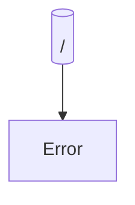

# 📊 FreeTools Workspace Report

> **Generated:** 2026-01-02 10:54:39  
> **Repository:** FreeCICD  
> **Scope:** Blazor pages only — API endpoints not included  

---

## 📑 Table of Contents

- [About This Report](#-about-this-report)
- [Workspace Overview](#-workspace-overview)
- [File Statistics](#-file-statistics)
- [Code Distribution](#-code-distribution)
- [Largest Files](#-largest-files)
- [Large File Warnings](#%EF%B8%8F-large-file-warnings)
- [Blazor Page Routes](#%EF%B8%8F-blazor-page-routes)
- [Route Map](#-route-map)
- [Screenshot Health](#-screenshot-health)
- [Screenshot Gallery](#-screenshot-gallery)

---

## 📋 About This Report

This report is auto-generated by the **WorkspaceReporter** tool pipeline.

### Scope

| Included | Not Included |
|----------|--------------|
| ✅ Blazor pages (`@page` directives) | ❌ API endpoints (`/api/*`) |
| ✅ Razor components | ❌ Dynamic routes (MapGet/MapPost) |
| ✅ C# source files | ❌ Routes with parameters (`{id}`) |
| ✅ Configuration files | |

### File Categories (Kind)

| Kind | Description |
|------|-------------|
| **RazorPage** | `.razor` file with `@page` directive (routable) |
| **RazorComponent** | `.razor` file without `@page` (reusable component) |
| **CSharpSource** | `.cs` file (classes, services, etc.) |
| **ProjectFile** | `.csproj` file (project configuration) |
| **SolutionFile** | `.sln` file (solution configuration) |
| **Config** | `.json`, `.xml`, `.yaml`, `.yml`, `.config` files |
| **Markdown** | `.md` documentation files |

---

## 📁 Workspace Overview

| Metric | Value |
|--------|-------|
| **Total Files** | 47 |
| **Total Lines** | 5,498 |
| **Total Characters** | 215,581 |
| **Total Size** | 210.5 KB |
| **Avg Lines/File** | 117.0 |
| **Avg Size/File** | 4.5 KB |

## 📈 File Statistics

### By Category

| Category | Count | Avg Lines | Total Lines | Percentage |
|----------|------:|----------:|------------:|------------|
| CSharpSource | 35 | 115 | 4,037 | [██████████████░░░░░░] 74.5% |
| Config | 5 | 38 | 191 | [██░░░░░░░░░░░░░░░░░░] 10.6% |
| RazorComponent | 3 | 165 | 496 | [█░░░░░░░░░░░░░░░░░░░] 6.4% |
| Markdown | 2 | 336 | 673 | [█░░░░░░░░░░░░░░░░░░░░] 4.3% |
| ProjectFile | 1 | 65 | 65 | [█░░░░░░░░░░░░░░░░░░░░] 2.1% |
| RazorPage | 1 | 36 | 36 | [█░░░░░░░░░░░░░░░░░░░░] 2.1% |

### Files by Category

<details>
<summary><strong>CSharpSource</strong> (35 files)</summary>

| File | Lines | Size |
|------|------:|-----:|
| [Classes/ConfigurationHelper.App.cs](../../../../../../FreeCICD/Classes/ConfigurationHelper.App.cs) | 25 | 512 bytes |
| [Classes/ConfigurationHelper.App.FreeCICD.cs](../../../../../../FreeCICD/Classes/ConfigurationHelper.App.FreeCICD.cs) | 53 | 1.1 KB |
| [Classes/ConfigurationHelper.cs](../../../../../../FreeCICD/Classes/ConfigurationHelper.cs) | 72 | 1.9 KB |
| [Classes/CustomAuthenticationHandler.cs](../../../../../../FreeCICD/Classes/CustomAuthenticationHandler.cs) | 87 | 3.3 KB |
| [Classes/CustomAuthIdentity.cs](../../../../../../FreeCICD/Classes/CustomAuthIdentity.cs) | 229 | 8.6 KB |
| [Classes/RouteHelper.cs](../../../../../../FreeCICD/Classes/RouteHelper.cs) | 99 | 2.5 KB |
| [Controllers/AuthorizationController.cs](../../../../../../FreeCICD/Controllers/AuthorizationController.cs) | 380 | 14.6 KB |
| [Controllers/DataController.Ajax.cs](../../../../../../FreeCICD/Controllers/DataController.Ajax.cs) | 16 | 427 bytes |
| [Controllers/DataController.App.cs](../../../../../../FreeCICD/Controllers/DataController.App.cs) | 34 | 1.0 KB |
| [Controllers/DataController.App.FreeCICD.cs](../../../../../../FreeCICD/Controllers/DataController.App.FreeCICD.cs) | 528 | 24.4 KB |
| [Controllers/DataController.ApplicationSettings.cs](../../../../../../FreeCICD/Controllers/DataController.ApplicationSettings.cs) | 25 | 792 bytes |
| [Controllers/DataController.Authenticate.cs](../../../../../../FreeCICD/Controllers/DataController.Authenticate.cs) | 29 | 1.0 KB |
| [Controllers/DataController.cs](../../../../../../FreeCICD/Controllers/DataController.cs) | 132 | 4.9 KB |
| [Controllers/DataController.Departments.cs](../../../../../../FreeCICD/Controllers/DataController.Departments.cs) | 79 | 2.5 KB |
| [Controllers/DataController.Encryption.cs](../../../../../../FreeCICD/Controllers/DataController.Encryption.cs) | 89 | 2.6 KB |
| [Controllers/DataController.FileStorage.cs](../../../../../../FreeCICD/Controllers/DataController.FileStorage.cs) | 186 | 6.1 KB |
| [Controllers/DataController.Language.cs](../../../../../../FreeCICD/Controllers/DataController.Language.cs) | 50 | 1.5 KB |
| [Controllers/DataController.Plugins.cs](../../../../../../FreeCICD/Controllers/DataController.Plugins.cs) | 17 | 431 bytes |
| [Controllers/DataController.Tags.cs](../../../../../../FreeCICD/Controllers/DataController.Tags.cs) | 43 | 1.2 KB |
| [Controllers/DataController.Tenants.cs](../../../../../../FreeCICD/Controllers/DataController.Tenants.cs) | 109 | 3.2 KB |
| [Controllers/DataController.UDF.cs](../../../../../../FreeCICD/Controllers/DataController.UDF.cs) | 25 | 752 bytes |
| [Controllers/DataController.UserGroups.cs](../../../../../../FreeCICD/Controllers/DataController.UserGroups.cs) | 43 | 1.3 KB |
| [Controllers/DataController.Users.cs](../../../../../../FreeCICD/Controllers/DataController.Users.cs) | 230 | 7.2 KB |
| [Controllers/DataController.Utilities.cs](../../../../../../FreeCICD/Controllers/DataController.Utilities.cs) | 218 | 6.9 KB |
| [Controllers/SetupController.cs](../../../../../../FreeCICD/Controllers/SetupController.cs) | 144 | 7.0 KB |
| [Hubs/signalrHub.cs](../../../../../../FreeCICD/Hubs/signalrHub.cs) | 45 | 1.4 KB |
| [Plugins/Example1.cs](../../../../../../FreeCICD/Plugins/Example1.cs) | 343 | 16.0 KB |
| [Plugins/Example2.cs](../../../../../../FreeCICD/Plugins/Example2.cs) | 35 | 1.2 KB |
| [Plugins/Example3.cs](../../../../../../FreeCICD/Plugins/Example3.cs) | 49 | 1.7 KB |
| [Plugins/LoginWithPrompts.cs](../../../../../../FreeCICD/Plugins/LoginWithPrompts.cs) | 218 | 9.3 KB |
| [Plugins/UserUpdate.cs](../../../../../../FreeCICD/Plugins/UserUpdate.cs) | 50 | 1.8 KB |
| [PluginsInterfaces.cs](../../../../../../FreeCICD/PluginsInterfaces.cs) | 56 | 1.6 KB |
| [Program.App.cs](../../../../../../FreeCICD/Program.App.cs) | 54 | 1.5 KB |
| [Program.App.FreeCICD.cs](../../../../../../FreeCICD/Program.App.FreeCICD.cs) | 24 | 911 bytes |
| [Program.cs](../../../../../../FreeCICD/Program.cs) | 221 | 10.5 KB |

</details>

<details>
<summary><strong>Config</strong> (5 files)</summary>

| File | Lines | Size |
|------|------:|-----:|
| [.config/dotnet-tools.json](../../../../../../FreeCICD/.config/dotnet-tools.json) | 13 | 182 bytes |
| [appsettings.Development.json](../../../../../../FreeCICD/appsettings.Development.json) | 8 | 119 bytes |
| [appsettings.json](../../../../../../FreeCICD/appsettings.json) | 112 | 2.4 KB |
| [Properties/launchSettings.json](../../../../../../FreeCICD/Properties/launchSettings.json) | 41 | 1.3 KB |
| [web.config](../../../../../../FreeCICD/web.config) | 17 | 697 bytes |

</details>

<details>
<summary><strong>RazorComponent</strong> (3 files)</summary>

| File | Lines | Size |
|------|------:|-----:|
| [Components/_Imports.razor](../../../../../../FreeCICD/Components/_Imports.razor) | 11 | 397 bytes |
| [Components/App.razor](../../../../../../FreeCICD/Components/App.razor) | 433 | 17.7 KB |
| [Components/Modules.App.razor](../../../../../../FreeCICD/Components/Modules.App.razor) | 52 | 1.8 KB |

</details>

<details>
<summary><strong>Markdown</strong> (2 files)</summary>

| File | Lines | Size |
|------|------:|-----:|
| [Plugins/Plugins.md](../../../../../../FreeCICD/Plugins/Plugins.md) | 229 | 11.3 KB |
| [README.md](../../../../../../FreeCICD/README.md) | 444 | 19.5 KB |

</details>

<details>
<summary><strong>ProjectFile</strong> (1 files)</summary>

| File | Lines | Size |
|------|------:|-----:|
| [FreeCICD.csproj](../../../../../../FreeCICD/FreeCICD.csproj) | 65 | 2.5 KB |

</details>

<details>
<summary><strong>RazorPage</strong> (1 files)</summary>

| File | Lines | Size |
|------|------:|-----:|
| [Components/Pages/Error.razor](../../../../../../FreeCICD/Components/Pages/Error.razor) | 36 | 1.2 KB |

</details>

## 📊 Code Distribution

### Lines of Code by Category

```
CSharpSource         ████████████████████████████████████████ 4,037
Markdown             ██████ 673
RazorComponent       ████ 496
Config               █ 191
ProjectFile          █ 65
RazorPage            █ 36
```

### By Extension

```
.cs        ██████████████████████████████ 35
.json      ███ 4
.razor     ███ 4
.md        █ 2
.csproj    █ 1
.config    █ 1
```

## 📏 Largest Files

### Top 15 C# Files by Line Count

| # | File | Lines | Size |
|--:|------|------:|-----:|
| 1 | [Controllers/DataController.App.FreeCICD.cs](../../../../../../FreeCICD/Controllers/DataController.App.FreeCICD.cs) | 528 | 24.4 KB |
| 2 | [Controllers/AuthorizationController.cs](../../../../../../FreeCICD/Controllers/AuthorizationController.cs) | 380 | 14.6 KB |
| 3 | [Plugins/Example1.cs](../../../../../../FreeCICD/Plugins/Example1.cs) | 343 | 16.0 KB |
| 4 | [Controllers/DataController.Users.cs](../../../../../../FreeCICD/Controllers/DataController.Users.cs) | 230 | 7.2 KB |
| 5 | [Classes/CustomAuthIdentity.cs](../../../../../../FreeCICD/Classes/CustomAuthIdentity.cs) | 229 | 8.6 KB |
| 6 | [Program.cs](../../../../../../FreeCICD/Program.cs) | 221 | 10.5 KB |
| 7 | [Controllers/DataController.Utilities.cs](../../../../../../FreeCICD/Controllers/DataController.Utilities.cs) | 218 | 6.9 KB |
| 8 | [Plugins/LoginWithPrompts.cs](../../../../../../FreeCICD/Plugins/LoginWithPrompts.cs) | 218 | 9.3 KB |
| 9 | [Controllers/DataController.FileStorage.cs](../../../../../../FreeCICD/Controllers/DataController.FileStorage.cs) | 186 | 6.1 KB |
| 10 | [Controllers/SetupController.cs](../../../../../../FreeCICD/Controllers/SetupController.cs) | 144 | 7.0 KB |
| 11 | [Controllers/DataController.cs](../../../../../../FreeCICD/Controllers/DataController.cs) | 132 | 4.9 KB |
| 12 | [Controllers/DataController.Tenants.cs](../../../../../../FreeCICD/Controllers/DataController.Tenants.cs) | 109 | 3.2 KB |
| 13 | [Classes/RouteHelper.cs](../../../../../../FreeCICD/Classes/RouteHelper.cs) | 99 | 2.5 KB |
| 14 | [Controllers/DataController.Encryption.cs](../../../../../../FreeCICD/Controllers/DataController.Encryption.cs) | 89 | 2.6 KB |
| 15 | [Classes/CustomAuthenticationHandler.cs](../../../../../../FreeCICD/Classes/CustomAuthenticationHandler.cs) | 87 | 3.3 KB |

### Top 15 Razor Files by Line Count

| # | File | Lines | Kind |
|--:|------|------:|------|
| 1 | [Components/App.razor](../../../../../../FreeCICD/Components/App.razor) | 433 | RazorComponent |
| 2 | [Components/Modules.App.razor](../../../../../../FreeCICD/Components/Modules.App.razor) | 52 | RazorComponent |
| 3 | [Components/Pages/Error.razor](../../../../../../FreeCICD/Components/Pages/Error.razor) | 36 | RazorPage |
| 4 | [Components/_Imports.razor](../../../../../../FreeCICD/Components/_Imports.razor) | 11 | RazorComponent |

## ⚠️ Large File Warnings

> **LLM-Friendly File Size Guide:**
> - ✅ **Ideal:** 0-450 lines (1-3 LLM reads at ~150 lines each)
> - 🟡 **Notice:** 450-600 lines (getting long)
> - 🟠 **Warning:** 600-900 lines (too long)
> - 🔴 **Critical:** >900 lines (should split)

**1 files** exceed the ideal threshold of 450 lines:

| File | Lines | Kind | Severity | Recommendation |
|------|------:|------|:--------:|----------------|
| [...ollers/DataController.App.FreeCICD.cs](../../../../../../FreeCICD/Controllers/DataController.App.FreeCICD.cs) | 528 | CSharpSource | 🟡 Notice | Review for single responsibility |

### Severity Summary

| Severity | Count | Description |
|----------|------:|-------------|
| 🔴 Critical | 0 | >900 lines — strongly consider splitting |
| 🟠 Warning | 0 | 600-900 lines — review for refactoring |
| 🟡 Notice | 1 | 450-600 lines — monitor for growth |

**46 of 47 files (98%)** are within the ideal range (≤450 lines).

## 🛤️ Blazor Page Routes

> **Note:** This section shows Blazor pages with `@page` directives only.
> API endpoints (`/api/*`) are not included. Routes with parameters are skipped.

### Route Summary

| Metric | Count |
|--------|------:|
| **Testable Routes** | 1 |
| **Public Routes** | 1 |
| **Auth Required** | 0 |
| **Skipped (parameters)** | 0 |

### Access Distribution

```
🔓 Public:     [██████████████████████████████░] 100%
🔐 Protected:  [█░░░░░░░░░░░░░░░░░░░░░░░░░░░░░░] 0%
```

### Routes by Area

<details>
<summary><strong>Components</strong> (1 routes)</summary>

| Route | Auth |
|-------|:----:|
| `/Error` | 🔓 |

</details>

## 🗺️ Route Map

> Visual representation of the route hierarchy. GitHub renders this as an interactive diagram.



### Route Depth Analysis

| Depth | Count | Routes |
|------:|------:|--------|
| 1 | 1 | `/Error` |

## 📊 Screenshot Health

| Status | Count | Description |
|--------|------:|-------------|
| ✅ Success | 1 | Screenshots > 10KB |
| 🔓 Public | 1 | Single screenshot pages |
| 🔐 Auth Required | 0 | Pages requiring login |
| ✅ Auth Flow OK | 0 | Login flow completed |
| ⚠️ Suspicious | 0 | Screenshots < 10KB (possible blank) |
| 🔄 Retried | 0 | Required retry attempt |
| ❌ HTTP Error | 0 | 4xx/5xx responses |
| 💥 Failed | 0 | Browser/timeout errors |
| 🔴 JS Errors | 0 | Pages with console errors |

**Overall Success Rate:** 100% (1/1 pages captured cleanly)

## 📸 Screenshot Gallery

**1 page screenshots captured**

### Quick Status

| ✅ Success | 🔐 Auth Flow | ❌ Errors |
|:----------:|:------------:|:---------:|
| 1 | 0 | 0 |

---

### 🔓 Public Pages (1)

Click on a screenshot to view full size.

<details open>
<summary><strong>📁 Error</strong> (1 pages)</summary>

<table>
<tr>
<td align="center" width="33%">
<a href="snapshots/Error/default.png">

</a>
<br /><code>/Error</code>
</td>
<td></td>
<td></td>
</tr>
</table>

</details>

---

## 🔧 Tool Information

This report was generated by the **WorkspaceReporter** tool, which aggregates outputs from:

| Tool | Purpose |
|------|---------|
| **WorkspaceInventory** | Scans codebase, extracts metrics and classifications |
| **EndpointMapper** | Discovers Blazor routes from `@page` directives |
| **EndpointPoker** | Performs HTTP GET requests to verify routes |
| **BrowserSnapshot** | Captures full-page screenshots with Playwright |

---

**[FreeTools](https://github.com/WSU-EIT/FreeTools)** — Open source workspace analysis tools for .NET projects

Developed by [Enrollment Information Technology](https://em.wsu.edu/eit/meet-our-staff/) at Washington State University

